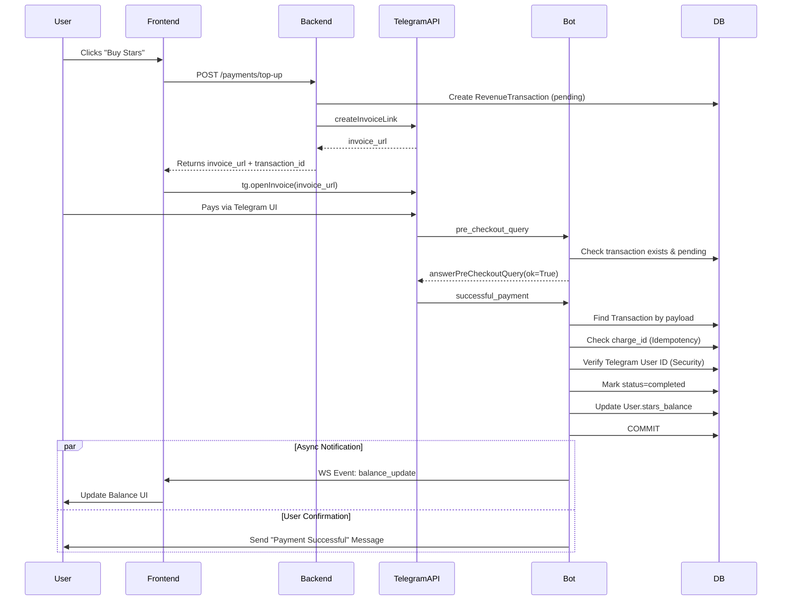

# Telegram Stars Payment Flow

```mermaid
sequenceDiagram
    participant User
    participant Frontend
    participant Backend
    participant TelegramAPI
    participant Bot
    participant DB

    User->>Frontend: Clicks "Buy Stars"
    Frontend->>Backend: POST /payments/top-up
    Backend->>DB: Create RevenueTransaction (pending)
    Backend->>TelegramAPI: createInvoiceLink
    TelegramAPI-->>Backend: invoice_url
    Backend-->>Frontend: Returns invoice_url + transaction_id
    
    Frontend->>TelegramAPI: tg.openInvoice(invoice_url)
    User->>TelegramAPI: Pays via Telegram UI
    
    TelegramAPI->>Bot: pre_checkout_query
    Bot->>DB: Check transaction exists & pending
    Bot-->>TelegramAPI: answerPreCheckoutQuery(ok=True)
    
    TelegramAPI->>Bot: successful_payment
    Bot->>DB: Find Transaction by payload
    Bot->>DB: Check charge_id (Idempotency)
    Bot->>DB: Verify Telegram User ID (Security)
    Bot->>DB: Mark status=completed
    Bot->>DB: Update User.stars_balance
    Bot->>DB: COMMIT
    
    par Async Notification
        Bot->>Frontend: WS Event: balance_update
        Frontend->>User: Update Balance UI
    and User Confirmation
        Bot->>User: Send "Payment Successful" Message
    end
```
