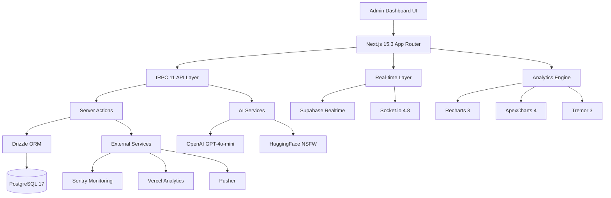

# 🚀 Enterprise Admin Dashboard - Dating Platform 2.0 (130+ Features)

# 🚀 Enterprise Admin Dashboard - Dating Platform 2.0

## 📋 Executive Summary

**Comprehensive enterprise-grade admin dashboard** для управления dating platform с 130+ возможностями, real-time analytics, AI-powered moderation, и advanced monetization tools.

**Tech Stack (Production 2026):**

- **Frontend:** Next.js 15.3 (App Router + RSC), React 19.3, TypeScript 5.6
- **UI:** Tailwind CSS 4.0 + Shadcn/UI 2.5 + Dark Glassmorphism + Framer Motion 12
- **State:** Zustand 5 + TanStack Query 5 + React Hook Form 8
- **Backend:** tRPC 11 + Server Actions + Drizzle ORM + PostgreSQL 17
- **Real-time:** Supabase Realtime + Socket.io 4.8 + Pusher
- **Charts:** Recharts 3 + ApexCharts 4 + Tremor 3
- **AI/ML:** OpenAI GPT-4o-mini + HuggingFace (NSFW модерация) + Vercel AI SDK
- **Infra:** Docker + Turborepo 2 + Vercel/Railway deploy

---

## 🏗️ Architecture Overview



---

## 📁 Project Structure

```
dating-platform-admin/
├── apps/
│   ├── admin/                          # Admin Dashboard App
│   │   ├── app/
│   │   │   ├── (admin)/               # Admin Layout Group
│   │   │   │   ├── dashboard/         # Main Dashboard
│   │   │   │   │   ├── page.tsx
│   │   │   │   │   └── loading.tsx
│   │   │   │   ├── analytics/         # Analytics Pages
│   │   │   │   │   ├── overview/
│   │   │   │   │   ├── retention/
│   │   │   │   │   ├── funnels/
│   │   │   │   │   ├── revenue/
│   │   │   │   │   ├── churn/
│   │   │   │   │   └── ab-testing/
│   │   │   │   ├── users/             # User Management
│   │   │   │   │   ├── page.tsx
│   │   │   │   │   ├── [id]/
│   │   │   │   │   ├── verification/
│   │   │   │   │   ├── segments/
│   │   │   │   │   └── exports/
│   │   │   │   ├── moderation/        # Content Moderation
│   │   │   │   │   ├── photos/
│   │   │   │   │   ├── chat/
│   │   │   │   │   ├── reports/
│   │   │   │   │   ├── appeals/
│   │   │   │   │   └── ai-queue/
│   │   │   │   ├── monetization/      # Revenue Management
│   │   │   │   │   ├── subscriptions/
│   │   │   │   │   ├── pricing/
│   │   │   │   │   ├── promos/
│   │   │   │   │   ├── refunds/
│   │   │   │   │   └── analytics/
│   │   │   │   ├── marketing/         # Marketing Tools
│   │   │   │   │   ├── campaigns/
│   │   │   │   │   ├── referrals/
│   │   │   │   │   ├── push/
│   │   │   │   │   ├── email/
│   │   │   │   │   └── seo/
│   │   │   │   ├── system/            # System Operations
│   │   │   │   │   ├── health/
│   │   │   │   │   ├── logs/
│   │   │   │   │   ├── security/
│   │   │   │   │   ├── backups/
│   │   │   │   │   └── config/
│   │   │   │   └── layout.tsx
│   │   │   ├── api/
│   │   │   │   └── trpc/
│   │   │   │       └── [trpc]/
│   │   │   │           └── route.ts
│   │   │   ├── layout.tsx
│   │   │   └── page.tsx
│   │   ├── components/
│   │   │   ├── analytics/
│   │   │   │   ├── RevenueChart.tsx
│   │   │   │   ├── RetentionHeatmap.tsx
│   │   │   │   ├── FunnelChart.tsx
│   │   │   │   ├── ChurnPrediction.tsx
│   │   │   │   ├── GeoHeatmap.tsx
│   │   │   │   └── KPICard.tsx
│   │   │   ├── users/
│   │   │   │   ├── UserTable.tsx
│   │   │   │   ├── UserCard.tsx
│   │   │   │   ├── UserProfile.tsx
│   │   │   │   ├── UserTimeline.tsx
│   │   │   │   ├── FraudScore.tsx
│   │   │   │   └── BulkActions.tsx
│   │   │   ├── moderation/
│   │   │   │   ├── ModerationQueue.tsx
│   │   │   │   ├── PhotoReview.tsx
│   │   │   │   ├── ChatReview.tsx
│   │   │   │   ├── NSFWDetector.tsx
│   │   │   │   └── AppealHandler.tsx
│   │   │   ├── monetization/
│   │   │   │   ├── SubscriptionManager.tsx
│   │   │   │   ├── PricingTable.tsx
│   │   │   │   ├── PromoCodeGenerator.tsx
│   │   │   │   └── RefundProcessor.tsx
│   │   │   ├── marketing/
│   │   │   │   ├── CampaignBuilder.tsx
│   │   │   │   ├── PushNotificationComposer.tsx
│   │   │   │   ├── EmailCampaign.tsx
│   │   │   │   └── ReferralDashboard.tsx
│   │   │   ├── system/
│   │   │   │   ├── SystemHealth.tsx
│   │   │   │   ├── AuditLog.tsx
│   │   │   │   ├── SecurityAlerts.tsx
│   │   │   │   └── FeatureFlags.tsx
│   │   │   ├── ui/
│   │   │   │   ├── GlassPanel.tsx
│   │   │   │   ├── DataTable.tsx
│   │   │   │   ├── StatCard.tsx
│   │   │   │   ├── Modal.tsx
│   │   │   │   └── Toast.tsx
│   │   │   └── layout/
│   │   │       ├── Sidebar.tsx
│   │   │       ├── Header.tsx
│   │   │       └── Breadcrumbs.tsx
│   │   ├── lib/
│   │   │   ├── trpc/
│   │   │   │   ├── client.ts
│   │   │   │   ├── server.ts
│   │   │   │   └── react.tsx
│   │   │   ├── db/
│   │   │   │   ├── schema.ts
│   │   │   │   ├── client.ts
│   │   │   │   └── migrations/
│   │   │   ├── ai/
│   │   │   │   ├── openai.ts
│   │   │   │   ├── huggingface.ts
│   │   │   │   └── moderation.ts
│   │   │   ├── realtime/
│   │   │   │   ├── supabase.ts
│   │   │   │   ├── socketio.ts
│   │   │   │   └── pusher.ts
│   │   │   └── utils/
│   │   │       ├── analytics.ts
│   │   │       ├── export.ts
│   │   │       └── validation.ts
│   │   ├── server/
│   │   │   ├── routers/
│   │   │   │   ├── analytics.ts
│   │   │   │   ├── users.ts
│   │   │   │   ├── moderation.ts
│   │   │   │   ├── monetization.ts
│   │   │   │   ├── marketing.ts
│   │   │   │   └── system.ts
│   │   │   ├── context.ts
│   │   │   └── index.ts
│   │   ├── styles/
│   │   │   └── globals.css
│   │   ├── public/
│   │   ├── package.json
│   │   ├── tsconfig.json
│   │   └── next.config.ts
│   └── web/                            # Main Dating App (existing)
├── packages/
│   ├── ui/                             # Shared UI Components
│   ├── database/                       # Drizzle Schema & Migrations
│   ├── api/                            # tRPC API Definitions
│   └── config/                         # Shared Config
├── docker/
│   ├── Dockerfile.admin
│   ├── Dockerfile.web
│   └── docker-compose.yml
├── .github/
│   └── workflows/
│       ├── deploy-admin.yml
│       └── deploy-web.yml
├── turbo.json
├── package.json
└── README.md
```

---

## 🎨 Design System: Dark Glassmorphism 2.0

### Color Palette

```css
:root {
  /* Glass Effects */
  --glass-bg: rgba(15, 23, 42, 0.65);
  --glass-bg-light: rgba(30, 41, 59, 0.5);
  --glass-border: rgba(148, 163, 184, 0.25);
  
  /* Neon Accents */
  --neon-blue: #3b82f6;
  --neon-purple: #a855f7;
  --neon-pink: #ec4899;
  --neon-green: #10b981;
  
  /* Glow Effects */
  --glow-blue: 0 0 20px rgba(59, 130, 246, 0.4);
  --glow-purple: 0 0 20px rgba(168, 85, 247, 0.4);
  --glow-pink: 0 0 20px rgba(236, 72, 153, 0.4);
  
  /* Blur */
  --blur: blur(20px);
  --blur-heavy: blur(40px);
  
  /* Gradients */
  --gradient-primary: linear-gradient(135deg, #667eea 0%, #764ba2 100%);
  --gradient-success: linear-gradient(135deg, #10b981 0%, #059669 100%);
  --gradient-danger: linear-gradient(135deg, #ef4444 0%, #dc2626 100%);
}

/* Glass Panel Component */
.glass-panel {
  background: var(--glass-bg);
  backdrop-filter: var(--blur);
  border: 1px solid var(--glass-border);
  border-radius: 16px;
  box-shadow: 
    0 32px 64px rgba(0, 0, 0, 0.6),
    var(--glow-blue),
    inset 0 1px 0 rgba(255, 255, 255, 0.1);
  transition: all 0.3s cubic-bezier(0.4, 0, 0.2, 1);
}

.glass-panel:hover {
  transform: translateY(-2px);
  box-shadow: 
    0 40px 80px rgba(0, 0, 0, 0.7),
    var(--glow-blue);
}

/* Neon Button */
.neon-button {
  background: var(--gradient-primary);
  border: none;
  border-radius: 12px;
  padding: 12px 24px;
  color: white;
  font-weight: 600;
  box-shadow: var(--glow-blue);
  transition: all 0.3s ease;
}

.neon-button:hover {
  box-shadow: 0 0 30px rgba(59, 130, 246, 0.6);
  transform: scale(1.05);
}
```

---

## 💾 Database Schema (Drizzle ORM)

### Core Tables

```typescript
// packages/database/src/schema/admin.ts

import { pgTable, uuid, varchar, text, timestamp, integer, boolean, jsonb, decimal, index } from 'drizzle-orm/pg-core';

// ============================================
// ANALYTICS TABLES
// ============================================

export const analyticsEvents = pgTable('analytics_events', {
  id: uuid('id').primaryKey().defaultRandom(),
  userId: uuid('user_id').references(() => users.id),
  eventType: varchar('event_type', { length: 100 }).notNull(),
  eventData: jsonb('event_data'),
  sessionId: varchar('session_id', { length: 255 }),
  deviceType: varchar('device_type', { length: 50 }),
  platform: varchar('platform', { length: 50 }),
  ipAddress: varchar('ip_address', { length: 45 }),
  userAgent: text('user_agent'),
  createdAt: timestamp('created_at').defaultNow().notNull(),
}, (table) => ({
  userIdIdx: index('analytics_events_user_id_idx').on(table.userId),
  eventTypeIdx: index('analytics_events_event_type_idx').on(table.eventType),
  createdAtIdx: index('analytics_events_created_at_idx').on(table.createdAt),
}));

export const dailyMetrics = pgTable('daily_metrics', {
  id: uuid('id').primaryKey().defaultRandom(),
  date: timestamp('date').notNull(),
  dau: integer('dau').notNull(),
  mau: integer('mau').notNull(),
  wau: integer('wau').notNull(),
  newUsers: integer('new_users').notNull(),
  activeUsers: integer('active_users').notNull(),
  totalMatches: integer('total_matches').notNull(),
  totalMessages: integer('total_messages').notNull(),
  revenue: decimal('revenue', { precision: 10, scale: 2 }).notNull(),
  arpu: decimal('arpu', { precision: 10, scale: 2 }),
  arppu: decimal('arppu', { precision: 10, scale: 2 }),
  conversionRate: decimal('conversion_rate', { precision: 5, scale: 2 }),
  churnRate: decimal('churn_rate', { precision: 5, scale: 2 }),
  createdAt: timestamp('created_at').defaultNow().notNull(),
}, (table) => ({
  dateIdx: index('daily_metrics_date_idx').on(table.date),
}));

export const retentionCohorts = pgTable('retention_cohorts', {
  id: uuid('id').primaryKey().defaultRandom(),
  cohortDate: timestamp('cohort_date').notNull(),
  cohortSize: integer('cohort_size').notNull(),
  day1: integer('day_1'),
  day3: integer('day_3'),
  day7: integer('day_7'),
  day14: integer('day_14'),
  day30: integer('day_30'),
  day60: integer('day_60'),
  day90: integer('day_90'),
  createdAt: timestamp('created_at').defaultNow().notNull(),
}, (table) => ({
  cohortDateIdx: index('retention_cohorts_cohort_date_idx').on(table.cohortDate),
}));

// ============================================
// USER MANAGEMENT TABLES
// ============================================

export const userSegments = pgTable('user_segments', {
  id: uuid('id').primaryKey().defaultRandom(),
  name: varchar('name', { length: 255 }).notNull(),
  description: text('description'),
  criteria: jsonb('criteria').notNull(),
  userCount: integer('user_count').default(0),
  isActive: boolean('is_active').default(true),
  createdBy: uuid('created_by').references(() => adminUsers.id),
  createdAt: timestamp('created_at').defaultNow().notNull(),
  updatedAt: timestamp('updated_at').defaultNow().notNull(),
});

export const fraudScores = pgTable('fraud_scores', {
  id: uuid('id').primaryKey().defaultRandom(),
  userId: uuid('user_id').references(() => users.id).notNull(),
  score: integer('score').notNull(), // 0-100
  riskLevel: varchar('risk_level', { length: 20 }).notNull(), // low, medium, high, critical
  factors: jsonb('factors'), // Array of risk factors
  aiConfidence: decimal('ai_confidence', { precision: 5, scale: 2 }),
  lastChecked: timestamp('last_checked').defaultNow().notNull(),
  createdAt: timestamp('created_at').defaultNow().notNull(),
}, (table) => ({
  userIdIdx: index('fraud_scores_user_id_idx').on(table.userId),
  riskLevelIdx: index('fraud_scores_risk_level_idx').on(table.riskLevel),
}));

export const userNotes = pgTable('user_notes', {
  id: uuid('id').primaryKey().defaultRandom(),
  userId: uuid('user_id').references(() => users.id).notNull(),
  adminId: uuid('admin_id').references(() => adminUsers.id).notNull(),
  note: text('note').notNull(),
  category: varchar('category', { length: 50 }),
  isImportant: boolean('is_important').default(false),
  createdAt: timestamp('created_at').defaultNow().notNull(),
}, (table) => ({
  userIdIdx: index('user_notes_user_id_idx').on(table.userId),
}));

// ============================================
// MODERATION TABLES
// ============================================

export const moderationQueue = pgTable('moderation_queue', {
  id: uuid('id').primaryKey().defaultRandom(),
  contentType: varchar('content_type', { length: 50 }).notNull(), // photo, chat, profile
  contentId: uuid('content_id').notNull(),
  userId: uuid('user_id').references(() => users.id).notNull(),
  status: varchar('status', { length: 20 }).notNull(), // pending, approved, rejected
  priority: integer('priority').default(0), // 0-10
  aiScore: decimal('ai_score', { precision: 5, scale: 2 }),
  aiFlags: jsonb('ai_flags'),
  reviewedBy: uuid('reviewed_by').references(() => adminUsers.id),
  reviewedAt: timestamp('reviewed_at'),
  reviewNotes: text('review_notes'),
  createdAt: timestamp('created_at').defaultNow().notNull(),
}, (table) => ({
  statusIdx: index('moderation_queue_status_idx').on(table.status),
  priorityIdx: index('moderation_queue_priority_idx').on(table.priority),
  createdAtIdx: index('moderation_queue_created_at_idx').on(table.createdAt),
}));

export const nsfwDetections = pgTable('nsfw_detections', {
  id: uuid('id').primaryKey().defaultRandom(),
  photoId: uuid('photo_id').notNull(),
  userId: uuid('user_id').references(() => users.id).notNull(),
  nsfwScore: decimal('nsfw_score', { precision: 5, scale: 2 }).notNull(),
  categories: jsonb('categories'), // {nudity: 0.95, violence: 0.02, ...}
  model: varchar('model', { length: 100 }),
  isBlocked: boolean('is_blocked').default(false),
  createdAt: timestamp('created_at').defaultNow().notNull(),
}, (table) => ({
  photoIdIdx: index('nsfw_detections_photo_id_idx').on(table.photoId),
  userIdIdx: index('nsfw_detections_user_id_idx').on(table.userId),
}));

export const reportedContent = pgTable('reported_content', {
  id: uuid('id').primaryKey().defaultRandom(),
  reporterId: uuid('reporter_id').references(() => users.id).notNull(),
  reportedUserId: uuid('reported_user_id').references(() => users.id).notNull(),
  contentType: varchar('content_type', { length: 50 }).notNull(),
  contentId: uuid('content_id'),
  reason: varchar('reason', { length: 100 }).notNull(),
  description: text('description'),
  status: varchar('status', { length: 20 }).default('pending'),
  resolvedBy: uuid('resolved_by').references(() => adminUsers.id),
  resolvedAt: timestamp('resolved_at'),
  resolution: text('resolution'),
  createdAt: timestamp('created_at').defaultNow().notNull(),
}, (table) => ({
  statusIdx: index('reported_content_status_idx').on(table.status),
  reportedUserIdx: index('reported_content_reported_user_idx').on(table.reportedUserId),
}));

// ============================================
// MONETIZATION TABLES
// ============================================

export const subscriptionPlans = pgTable('subscription_plans', {
  id: uuid('id').primaryKey().defaultRandom(),
  name: varchar('name', { length: 100 }).notNull(),
  tier: varchar('tier', { length: 50 }).notNull(), // free, gold, platinum
  price: decimal('price', { precision: 10, scale: 2 }).notNull(),
  currency: varchar('currency', { length: 3 }).default('USD'),
  duration: integer('duration').notNull(), // days
  features: jsonb('features').notNull(),
  isActive: boolean('is_active').default(true),
  createdAt: timestamp('created_at').defaultNow().notNull(),
  updatedAt: timestamp('updated_at').defaultNow().notNull(),
});

export const promoCodes = pgTable('promo_codes', {
  id: uuid('id').primaryKey().defaultRandom(),
  code: varchar('code', { length: 50 }).unique().notNull(),
  discountType: varchar('discount_type', { length: 20 }).notNull(), // percentage, fixed
  discountValue: decimal('discount_value', { precision: 10, scale: 2 }).notNull(),
  maxUses: integer('max_uses'),
  usedCount: integer('used_count').default(0),
  validFrom: timestamp('valid_from').notNull(),
  validUntil: timestamp('valid_until').notNull(),
  isActive: boolean('is_active').default(true),
  createdBy: uuid('created_by').references(() => adminUsers.id),
  createdAt: timestamp('created_at').defaultNow().notNull(),
}, (table) => ({
  codeIdx: index('promo_codes_code_idx').on(table.code),
}));

export const revenueTransactions = pgTable('revenue_transactions', {
  id: uuid('id').primaryKey().defaultRandom(),
  userId: uuid('user_id').references(() => users.id).notNull(),
  type: varchar('type', { length: 50 }).notNull(), // subscription, boost, gift
  amount: decimal('amount', { precision: 10, scale: 2 }).notNull(),
  currency: varchar('currency', { length: 3 }).default('USD'),
  status: varchar('status', { length: 20 }).notNull(), // pending, completed, failed, refunded
  paymentMethod: varchar('payment_method', { length: 50 }),
  paymentGateway: varchar('payment_gateway', { length: 50 }),
  transactionId: varchar('transaction_id', { length: 255 }),
  metadata: jsonb('metadata'),
  createdAt: timestamp('created_at').defaultNow().notNull(),
}, (table) => ({
  userIdIdx: index('revenue_transactions_user_id_idx').on(table.userId),
  statusIdx: index('revenue_transactions_status_idx').on(table.status),
  createdAtIdx: index('revenue_transactions_created_at_idx').on(table.createdAt),
}));

// ============================================
// MARKETING TABLES
// ============================================

export const campaigns = pgTable('campaigns', {
  id: uuid('id').primaryKey().defaultRandom(),
  name: varchar('name', { length: 255 }).notNull(),
  type: varchar('type', { length: 50 }).notNull(), // push, email, sms
  status: varchar('status', { length: 20 }).default('draft'), // draft, scheduled, active, completed
  targetSegment: uuid('target_segment').references(() => userSegments.id),
  content: jsonb('content').notNull(),
  scheduledAt: timestamp('scheduled_at'),
  sentCount: integer('sent_count').default(0),
  openedCount: integer('opened_count').default(0),
  clickedCount: integer('clicked_count').default(0),
  conversionCount: integer('conversion_count').default(0),
  createdBy: uuid('created_by').references(() => adminUsers.id),
  createdAt: timestamp('created_at').defaultNow().notNull(),
  updatedAt: timestamp('updated_at').defaultNow().notNull(),
});

export const abTests = pgTable('ab_tests', {
  id: uuid('id').primaryKey().defaultRandom(),
  name: varchar('name', { length: 255 }).notNull(),
  description: text('description'),
  feature: varchar('feature', { length: 100 }).notNull(),
  variants: jsonb('variants').notNull(), // [{name: 'A', config: {...}}, {name: 'B', config: {...}}]
  status: varchar('status', { length: 20 }).default('draft'),
  startDate: timestamp('start_date'),
  endDate: timestamp('end_date'),
  results: jsonb('results'),
  winner: varchar('winner', { length: 50 }),
  createdBy: uuid('created_by').references(() => adminUsers.id),
  createdAt: timestamp('created_at').defaultNow().notNull(),
});

// ============================================
// SYSTEM TABLES
// ============================================

export const adminUsers = pgTable('admin_users', {
  id: uuid('id').primaryKey().defaultRandom(),
  email: varchar('email', { length: 255 }).unique().notNull(),
  hashedPassword: varchar('hashed_password', { length: 255 }).notNull(),
  name: varchar('name', { length: 255 }).notNull(),
  role: varchar('role', { length: 50 }).notNull(), // super_admin, admin, moderator, analyst
  permissions: jsonb('permissions'),
  isActive: boolean('is_active').default(true),
  lastLoginAt: timestamp('last_login_at'),
  createdAt: timestamp('created_at').defaultNow().notNull(),
  updatedAt: timestamp('updated_at').defaultNow().notNull(),
});

export const auditLogs = pgTable('audit_logs', {
  id: uuid('id').primaryKey().defaultRandom(),
  adminId: uuid('admin_id').references(() => adminUsers.id).notNull(),
  action: varchar('action', { length: 100 }).notNull(),
  resource: varchar('resource', { length: 100 }).notNull(),
  resourceId: uuid('resource_id'),
  changes: jsonb('changes'),
  ipAddress: varchar('ip_address', { length: 45 }),
  userAgent: text('user_agent'),
  createdAt: timestamp('created_at').defaultNow().notNull(),
}, (table) => ({
  adminIdIdx: index('audit_logs_admin_id_idx').on(table.adminId),
  actionIdx: index('audit_logs_action_idx').on(table.action),
  createdAtIdx: index('audit_logs_created_at_idx').on(table.createdAt),
}));

export const featureFlags = pgTable('feature_flags', {
  id: uuid('id').primaryKey().defaultRandom(),
  name: varchar('name', { length: 100 }).unique().notNull(),
  description: text('description'),
  isEnabled: boolean('is_enabled').default(false),
  rolloutPercentage: integer('rollout_percentage').default(0), // 0-100
  targetSegments: jsonb('target_segments'),
  createdBy: uuid('created_by').references(() => adminUsers.id),
  createdAt: timestamp('created_at').defaultNow().notNull(),
  updatedAt: timestamp('updated_at').defaultNow().notNull(),
});

export const systemHealth = pgTable('system_health', {
  id: uuid('id').primaryKey().defaultRandom(),
  service: varchar('service', { length: 100 }).notNull(),
  status: varchar('status', { length: 20 }).notNull(), // healthy, degraded, down
  responseTime: integer('response_time'), // ms
  errorRate: decimal('error_rate', { precision: 5, scale: 2 }),
  cpuUsage: decimal('cpu_usage', { precision: 5, scale: 2 }),
  memoryUsage: decimal('memory_usage', { precision: 5, scale: 2 }),
  metadata: jsonb('metadata'),
  checkedAt: timestamp('checked_at').defaultNow().notNull(),
}, (table) => ({
  serviceIdx: index('system_health_service_idx').on(table.service),
  checkedAtIdx: index('system_health_checked_at_idx').on(table.checkedAt),
}));
```

---

## 🎯 130+ Features Breakdown

### 1️⃣ CORE ANALYTICS (20 Features)

1. **Real-time DAU/MAU/WAU Dashboard** - Live user activity metrics
2. **Retention Cohorts (D1-D30 Heatmaps)** - Visual retention analysis
3. **Funnel Analysis** - Signup→Profile→Matches→Chats→Paid conversion tracking
4. **Revenue Breakdown** - Subscriptions/Boosts/Ads revenue streams
5. **Churn Prediction ML Model** - AI-powered churn forecasting
6. **A/B Testing Results Dashboard** - Experiment performance tracking
7. **Geographic Heatmaps** - User distribution with Kaliningrad focus
8. **Device/OS/Browser Analytics** - Platform usage statistics
9. **Feature Usage Tracking** - Feature adoption metrics
10. **NPS/CSAT Scores** - Customer satisfaction tracking
11. **Match Success Rate by Demographics** - Demographic performance analysis
12. **Message Response Time Analytics** - Communication efficiency metrics
13. **Peak Hours Heatmap** - Activity pattern visualization
14. **Conversion Funnels by Acquisition Channel** - Channel performance
15. **LTV/CAC Ratio Calculator** - Customer value metrics
16. **Cohort Revenue Analysis** - Revenue by user cohorts
17. **User Journey Timelines** - Individual user path tracking
18. **Predictive Churn Alerts** - Proactive churn warnings
19. **Marketing ROI Dashboard** - Campaign effectiveness
20. **Custom KPI Builder** - Configurable metrics dashboard

### 2️⃣ USER MANAGEMENT (25 Features)

1. **Infinite Scroll Users Table** - High-performance user list with 100+ filters
2. **Bulk Actions** - Ban/Suspend/Verify multiple users
3. **Advanced Search** - Psychographics/Behavior-based search
4. **User Profiles Deep Dive** - Comprehensive user view
5. **Activity Timelines** - User action history
6. **Fraud Detection Scoring** - AI-powered fraud analysis
7. **Fake Profile Detector** - Automated fake account detection
8. **Verification Queue** - ID/Photo/Manual verification workflow
9. **Blacklist Management** - User blocking system
10. **VIP/Premium User Dashboard** - Premium user management
11. **User Segmentation (RFM Analysis)** - Recency/Frequency/Monetary segmentation
12. **Export Users** - CSV/Excel/JSON export functionality
13. **User Notes/Tags System** - Admin annotations
14. **Account Recovery Requests** - User account recovery handling
15. **Multi-Account Detection** - Duplicate account identification
16. **Age/Gender/Location Verification** - Profile data validation
17. **Phone/Email Validation Logs** - Contact verification tracking
18. **Login Attempt Monitoring** - Security event tracking
19. **Session Management** - Active session control
20. **User Feedback/Suggestions** - User input collection
21. **Complaint History** - User complaint tracking
22. **Behavioral Scoring** - User behavior analysis
23. **Engagement Scoring** - User engagement metrics
24. **Match Quality Scoring** - Match success prediction
25. **Profile Completeness Audit** - Profile quality assessment

### 3️⃣ CONTENT MODERATION (20 Features)

1. **Photo Moderation Queue** - AI pre-filtered photo review
2. **NSFW Detection (99% Accuracy)** - Advanced content filtering
3. **Text Moderation** - Toxic chat detection
4. **Report Handling Workflow** - User report processing
5. **Auto-Ban Thresholds** - Automated violation handling
6. **Manual Review Dashboard** - Human moderation interface
7. **Moderation Stats** - Moderator performance metrics
8. **Appeal Handling** - User appeal processing
9. **Policy Violation Trends** - Violation pattern analysis
10. **Watermarking System** - Content protection
11. **Content Aging** - Automatic old content deletion
12. **Duplicate Detection** - Duplicate content identification
13. **Profile Template Violations** - Template abuse detection
14. **Chat History Review** - Message history inspection
15. **Voice Note Transcription/Moderation** - Audio content moderation
16. **Video Verification** - Video content validation
17. **Live Stream Moderation** - Real-time stream monitoring (future)
18. **Community Guidelines Dashboard** - Policy management
19. **Moderation SLA Tracking** - Response time monitoring
20. **AI Moderator Performance Metrics** - AI accuracy tracking

### 4️⃣ MONETIZATION (15 Features)

1. **Subscription Tiers Management** - Plan configuration
2. **Pricing A/B Tests** - Price optimization experiments
3. **Promo Code Campaigns** - Discount code management
4. **Revenue Forecasts** - Predictive revenue modeling
5. **Refund Processing** - Refund workflow management
6. **Payment Gateway Monitoring** - Payment system health
7. **Failed Payments Retry** - Automatic payment retry
8. **Coupon Redemption Tracking** - Coupon usage analytics
9. **Boost/Superlike Analytics** - Premium feature usage
10. **Gift/Premium Feature Usage** - Virtual gift tracking
11. **Affiliate Program Dashboard** - Referral program management
12. **Revenue by Acquisition Channel** - Channel revenue attribution
13. **ARPU/MARPU Trends** - Revenue per user metrics
14. **Churn by Subscription Tier** - Tier-specific churn analysis
15. **Upsell Opportunity Detection** - Upgrade recommendation engine

### 5️⃣ MARKETING & GROWTH (15 Features)

1. **Campaign Performance** - Marketing campaign analytics
2. **Acquisition Channels ROI** - Channel effectiveness
3. **Referral Program Stats** - Referral performance tracking
4. **Push Notification Analytics** - Push campaign metrics
5. **Email Campaign Results** - Email marketing analytics
6. **Social Media Tracking** - Social media performance
7. **SEO Performance** - Search engine optimization metrics
8. **App Store Metrics** - App store performance tracking
9. **Viral Coefficient Calculator** - Virality measurement
10. **Growth Experiments Dashboard** - Growth test management
11. **User Acquisition Cost Breakdown** - CAC analysis
12. **Organic vs Paid Growth** - Growth source comparison
13. **Retention by Acquisition Source** - Source-specific retention
14. **Lifetime Value Prediction** - LTV forecasting
15. **Marketing Attribution** - Multi-touch attribution

### 6️⃣ SYSTEM & OPERATIONS (15 Features)

1. **System Health Monitoring** - Infrastructure health dashboard
2. **Database Performance** - DB metrics and optimization
3. **API Rate Limiting** - API usage control
4. **CDN Usage Stats** - Content delivery metrics
5. **Error Tracking (Sentry)** - Error monitoring integration
6. **Audit Logs** - Admin action tracking
7. **RBAC Permissions Matrix** - Role-based access control
8. **Team Member Activity** - Admin user activity tracking
9. **Backup Status** - Backup monitoring
10. **Security Alerts** - Security event notifications
11. **Compliance Dashboard (GDPR)** - Regulatory compliance
12. **Data Export Requests** - User data export handling
13. **Feature Flags Management** - Feature toggle control
14. **Config Management** - System configuration
15. **CI/CD Pipeline Status** - Deployment monitoring

### 7️⃣ ADVANCED FEATURES (20+ Features)

1. **AI Content Generation** - Profile tips and suggestions
2. **Match Algorithm Tuning** - Algorithm parameter adjustment
3. **Recommendation Engine Dashboard** - Recommendation system control
4. **Icebreaker Templates Management** - Conversation starter management
5. **Events/Virtual Dating Dashboard** - Event management
6. **White-label Partner Management** - Partner portal
7. **Multi-language Support Stats** - Localization analytics
8. **Accessibility Audit** - Accessibility compliance
9. **Performance Budget Monitoring** - Performance tracking
10. **Mobile Web PWA Stats** - Progressive web app metrics
11. **Voice/Video Call Analytics** - Call quality metrics
12. **NFT/Profile Collectibles** - Digital collectibles (future)
13. **Metaverse Integration Stats** - Metaverse metrics (future)
14. **Blockchain Verification Logs** - Blockchain integration (future)
15. **Web3 Wallet Connect Stats** - Web3 integration metrics (future)
16. **Custom Reports Builder (Type 1)** - User-defined reports
17. **Custom Reports Builder (Type 2)** - Advanced analytics reports
18. **Custom Reports Builder (Type 3)** - Financial reports
19. **Custom Reports Builder (Type 4)** - Marketing reports
20. **Custom Reports Builder (Type 5)** - Technical reports

---

## 🖼️ UI Wireframes

### Dashboard Overview

```wireframe

<html lang="en">
<head>
<meta charset="UTF-8">
<meta name="viewport" content="width=device-width, initial-scale=1.0">
<title>Admin Dashboard - Overview</title>
<style>
* {
  margin: 0;
  padding: 0;
  box-sizing: border-box;
}

body {
  font-family: -apple-system, BlinkMacSystemFont, 'Segoe UI', sans-serif;
  background: linear-gradient(135deg, #0f172a 0%, #1e293b 100%);
  color: #e2e8f0;
  min-height: 100vh;
}

.container {
  display: flex;
  min-height: 100vh;
}

/* Sidebar */
.sidebar {
  width: 280px;
  background: rgba(15, 23, 42, 0.65);
  backdrop-filter: blur(20px);
  border-right: 1px solid rgba(148, 163, 184, 0.25);
  padding: 24px;
}

.logo {
  font-size: 24px;
  font-weight: 700;
  margin-bottom: 40px;
  background: linear-gradient(135deg, #667eea 0%, #764ba2 100%);
  -webkit-background-clip: text;
  -webkit-text-fill-color: transparent;
}

.nav-item {
  padding: 12px 16px;
  margin-bottom: 8px;
  border-radius: 8px;
  cursor: pointer;
  transition: all 0.3s;
  display: flex;
  align-items: center;
  gap: 12px;
}

.nav-item:hover {
  background: rgba(59, 130, 246, 0.1);
  box-shadow: 0 0 20px rgba(59, 130, 246, 0.2);
}

.nav-item.active {
  background: rgba(59, 130, 246, 0.2);
  box-shadow: 0 0 20px rgba(59, 130, 246, 0.4);
}

/* Main Content */
.main-content {
  flex: 1;
  padding: 32px;
  overflow-y: auto;
}

.header {
  display: flex;
  justify-content: space-between;
  align-items: center;
  margin-bottom: 32px;
}

.header h1 {
  font-size: 32px;
  font-weight: 700;
}

.header-actions {
  display: flex;
  gap: 16px;
}

.btn {
  padding: 12px 24px;
  border-radius: 12px;
  border: none;
  cursor: pointer;
  font-weight: 600;
  transition: all 0.3s;
}

.btn-primary {
  background: linear-gradient(135deg, #667eea 0%, #764ba2 100%);
  color: white;
  box-shadow: 0 0 20px rgba(59, 130, 246, 0.4);
}

.btn-primary:hover {
  box-shadow: 0 0 30px rgba(59, 130, 246, 0.6);
  transform: scale(1.05);
}

/* Stats Grid */
.stats-grid {
  display: grid;
  grid-template-columns: repeat(4, 1fr);
  gap: 24px;
  margin-bottom: 32px;
}

.stat-card {
  background: rgba(15, 23, 42, 0.65);
  backdrop-filter: blur(20px);
  border: 1px solid rgba(148, 163, 184, 0.25);
  border-radius: 16px;
  padding: 24px;
  box-shadow: 0 32px 64px rgba(0, 0, 0, 0.6), 0 0 20px rgba(59, 130, 246, 0.4);
  transition: all 0.3s;
}

.stat-card:hover {
  transform: translateY(-4px);
  box-shadow: 0 40px 80px rgba(0, 0, 0, 0.7), 0 0 30px rgba(59, 130, 246, 0.6);
}

.stat-label {
  font-size: 14px;
  color: #94a3b8;
  margin-bottom: 8px;
}

.stat-value {
  font-size: 36px;
  font-weight: 700;
  margin-bottom: 8px;
}

.stat-change {
  font-size: 14px;
  display: flex;
  align-items: center;
  gap: 4px;
}

.stat-change.positive {
  color: #10b981;
}

.stat-change.negative {
  color: #ef4444;
}

/* Charts Grid */
.charts-grid {
  display: grid;
  grid-template-columns: repeat(2, 1fr);
  gap: 24px;
  margin-bottom: 32px;
}

.chart-card {
  background: rgba(15, 23, 42, 0.65);
  backdrop-filter: blur(20px);
  border: 1px solid rgba(148, 163, 184, 0.25);
  border-radius: 16px;
  padding: 24px;
  box-shadow: 0 32px 64px rgba(0, 0, 0, 0.6);
}

.chart-header {
  display: flex;
  justify-content: space-between;
  align-items: center;
  margin-bottom: 24px;
}

.chart-title {
  font-size: 18px;
  font-weight: 600;
}

.chart-placeholder {
  height: 300px;
  background: rgba(30, 41, 59, 0.5);
  border-radius: 8px;
  display: flex;
  align-items: center;
  justify-content: center;
  color: #64748b;
}

/* Table */
.table-card {
  background: rgba(15, 23, 42, 0.65);
  backdrop-filter: blur(20px);
  border: 1px solid rgba(148, 163, 184, 0.25);
  border-radius: 16px;
  padding: 24px;
  box-shadow: 0 32px 64px rgba(0, 0, 0, 0.6);
}

.table-header {
  display: flex;
  justify-content: space-between;
  align-items: center;
  margin-bottom: 24px;
}

.search-box {
  padding: 10px 16px;
  background: rgba(30, 41, 59, 0.5);
  border: 1px solid rgba(148, 163, 184, 0.25);
  border-radius: 8px;
  color: #e2e8f0;
  width: 300px;
}

table {
  width: 100%;
  border-collapse: collapse;
}

th {
  text-align: left;
  padding: 12px;
  border-bottom: 1px solid rgba(148, 163, 184, 0.25);
  color: #94a3b8;
  font-weight: 600;
}

td {
  padding: 16px 12px;
  border-bottom: 1px solid rgba(148, 163, 184, 0.15);
}

tr:hover {
  background: rgba(59, 130, 246, 0.05);
}

.badge {
  padding: 4px 12px;
  border-radius: 12px;
  font-size: 12px;
  font-weight: 600;
}

.badge-success {
  background: rgba(16, 185, 129, 0.2);
  color: #10b981;
}

.badge-warning {
  background: rgba(245, 158, 11, 0.2);
  color: #f59e0b;
}

.badge-danger {
  background: rgba(239, 68, 68, 0.2);
  color: #ef4444;
}
</style>
</meta></meta></head>
<body>
<div class="container">
  
  <aside class="sidebar">
    <div class="logo" data-element-id="logo">💎 Dating Admin</div>
    <nav>
      <div class="nav-item active" data-element-id="nav-dashboard">
        📊 Dashboard
      </div>
      <div class="nav-item" data-element-id="nav-analytics">
        📈 Analytics
      </div>
      <div class="nav-item" data-element-id="nav-users">
        👥 Users
      </div>
      <div class="nav-item" data-element-id="nav-moderation">
        🛡️ Moderation
      </div>
      <div class="nav-item" data-element-id="nav-monetization">
        💰 Monetization
      </div>
      <div class="nav-item" data-element-id="nav-marketing">
        📢 Marketing
      </div>
      <div class="nav-item" data-element-id="nav-system">
        ⚙️ System
      </div>
    </nav>
  </aside>

  
  <main class="main-content">
    
    <header class="header">
      <h1>Dashboard Overview</h1>
      <div class="header-actions">
        <button class="btn btn-primary" data-element-id="btn-export">
          📥 Export Report
        </button>
        <button class="btn btn-primary" data-element-id="btn-refresh">
          🔄 Refresh
        </button>
      </div>
    </header>

    
    <div class="stats-grid">
      <div class="stat-card" data-element-id="stat-dau">
        <div class="stat-label">Daily Active Users</div>
        <div class="stat-value">45,231</div>
        <div class="stat-change positive">
          ↑ 12.5% vs yesterday
        </div>
      </div>
      <div class="stat-card" data-element-id="stat-matches">
        <div class="stat-label">Total Matches Today</div>
        <div class="stat-value">8,942</div>
        <div class="stat-change positive">
          ↑ 8.3% vs yesterday
        </div>
      </div>
      <div class="stat-card" data-element-id="stat-revenue">
        <div class="stat-label">Revenue Today</div>
        <div class="stat-value">$12,450</div>
        <div class="stat-change positive">
          ↑ 15.7% vs yesterday
        </div>
      </div>
      <div class="stat-card" data-element-id="stat-churn">
        <div class="stat-label">Churn Rate</div>
        <div class="stat-value">2.3%</div>
        <div class="stat-change negative">
          ↓ 0.5% vs last week
        </div>
      </div>
    </div>

    
    <div class="charts-grid">
      <div class="chart-card" data-element-id="chart-users">
        <div class="chart-header">
          <div class="chart-title">User Growth (30 Days)</div>
          <select class="search-box" style="width: auto;" data-element-id="chart-users-period">
            <option>Last 30 Days</option>
            <option>Last 90 Days</option>
            <option>Last Year</option>
          </select>
        </div>
        <div class="chart-placeholder">
          📈 Line Chart: User Growth Trend
        </div>
      </div>

      <div class="chart-card" data-element-id="chart-revenue">
        <div class="chart-header">
          <div class="chart-title">Revenue Breakdown</div>
          <select class="search-box" style="width: auto;" data-element-id="chart-revenue-period">
            <option>This Month</option>
            <option>Last Month</option>
            <option>This Year</option>
          </select>
        </div>
        <div class="chart-placeholder">
          🥧 Pie Chart: Revenue by Source
        </div>
      </div>
    </div>

    
    <div class="table-card" data-element-id="recent-activity">
      <div class="table-header">
        <h2>Recent User Activity</h2>
        <input type="text" class="search-box" placeholder="Search users..." data-element-id="search-users">
      </input></div>
      <table>
        <thead>
          <tr>
            <th>User</th>
            <th>Action</th>
            <th>Status</th>
            <th>Time</th>
            <th>Actions</th>
          </tr>
        </thead>
        <tbody>
          <tr data-element-id="user-row-1">
            <td>Anna K. (ID: 12345)</td>
            <td>Profile Verified</td>
            <td><span class="badge badge-success">Active</span></td>
            <td>2 min ago</td>
            <td>
              <button class="btn" style="padding: 6px 12px; font-size: 12px;" data-element-id="view-user-1">View</button>
            </td>
          </tr>
          <tr data-element-id="user-row-2">
            <td>Dmitry S. (ID: 12346)</td>
            <td>Subscription Upgraded</td>
            <td><span class="badge badge-success">Premium</span></td>
            <td>5 min ago</td>
            <td>
              <button class="btn" style="padding: 6px 12px; font-size: 12px;" data-element-id="view-user-2">View</button>
            </td>
          </tr>
          <tr data-element-id="user-row-3">
            <td>Elena P. (ID: 12347)</td>
            <td>Photo Flagged</td>
            <td><span class="badge badge-warning">Review</span></td>
            <td>8 min ago</td>
            <td>
              <button class="btn" style="padding: 6px 12px; font-size: 12px;" data-element-id="view-user-3">Moderate</button>
            </td>
          </tr>
          <tr data-element-id="user-row-4">
            <td>Ivan M. (ID: 12348)</td>
            <td>Account Reported</td>
            <td><span class="badge badge-danger">Suspended</span></td>
            <td>12 min ago</td>
            <td>
              <button class="btn" style="padding: 6px 12px; font-size: 12px;" data-element-id="view-user-4">Review</button>
            </td>
          </tr>
        </tbody>
      </table>
    </div>
  </main>
</div>
</body>
</html>
```

### User Management Page

```wireframe

<html lang="en">
<head>
<meta charset="UTF-8">
<meta name="viewport" content="width=device-width, initial-scale=1.0">
<title>User Management</title>
<style>
* {
  margin: 0;
  padding: 0;
  box-sizing: border-box;
}

body {
  font-family: -apple-system, BlinkMacSystemFont, 'Segoe UI', sans-serif;
  background: linear-gradient(135deg, #0f172a 0%, #1e293b 100%);
  color: #e2e8f0;
  padding: 32px;
}

.page-header {
  display: flex;
  justify-content: space-between;
  align-items: center;
  margin-bottom: 32px;
}

.page-title {
  font-size: 32px;
  font-weight: 700;
}

.header-actions {
  display: flex;
  gap: 16px;
}

.btn {
  padding: 12px 24px;
  border-radius: 12px;
  border: none;
  cursor: pointer;
  font-weight: 600;
  transition: all 0.3s;
  background: linear-gradient(135deg, #667eea 0%, #764ba2 100%);
  color: white;
  box-shadow: 0 0 20px rgba(59, 130, 246, 0.4);
}

.btn:hover {
  box-shadow: 0 0 30px rgba(59, 130, 246, 0.6);
  transform: scale(1.05);
}

/* Filters Panel */
.filters-panel {
  background: rgba(15, 23, 42, 0.65);
  backdrop-filter: blur(20px);
  border: 1px solid rgba(148, 163, 184, 0.25);
  border-radius: 16px;
  padding: 24px;
  margin-bottom: 24px;
  box-shadow: 0 32px 64px rgba(0, 0, 0, 0.6);
}

.filters-grid {
  display: grid;
  grid-template-columns: repeat(4, 1fr);
  gap: 16px;
  margin-bottom: 16px;
}

.filter-group {
  display: flex;
  flex-direction: column;
  gap: 8px;
}

.filter-label {
  font-size: 14px;
  color: #94a3b8;
  font-weight: 600;
}

.filter-input {
  padding: 10px 16px;
  background: rgba(30, 41, 59, 0.5);
  border: 1px solid rgba(148, 163, 184, 0.25);
  border-radius: 8px;
  color: #e2e8f0;
}

.filter-actions {
  display: flex;
  gap: 12px;
  justify-content: flex-end;
}

/* Users Table */
.users-table-card {
  background: rgba(15, 23, 42, 0.65);
  backdrop-filter: blur(20px);
  border: 1px solid rgba(148, 163, 184, 0.25);
  border-radius: 16px;
  padding: 24px;
  box-shadow: 0 32px 64px rgba(0, 0, 0, 0.6);
}

.table-controls {
  display: flex;
  justify-content: space-between;
  align-items: center;
  margin-bottom: 24px;
}

.bulk-actions {
  display: flex;
  gap: 12px;
}

.search-box {
  padding: 10px 16px;
  background: rgba(30, 41, 59, 0.5);
  border: 1px solid rgba(148, 163, 184, 0.25);
  border-radius: 8px;
  color: #e2e8f0;
  width: 300px;
}

table {
  width: 100%;
  border-collapse: collapse;
}

th {
  text-align: left;
  padding: 12px;
  border-bottom: 1px solid rgba(148, 163, 184, 0.25);
  color: #94a3b8;
  font-weight: 600;
}

td {
  padding: 16px 12px;
  border-bottom: 1px solid rgba(148, 163, 184, 0.15);
}

tr:hover {
  background: rgba(59, 130, 246, 0.05);
}

.user-avatar {
  width: 40px;
  height: 40px;
  border-radius: 50%;
  background: linear-gradient(135deg, #667eea 0%, #764ba2 100%);
  display: flex;
  align-items: center;
  justify-content: center;
  font-weight: 700;
}

.user-info {
  display: flex;
  align-items: center;
  gap: 12px;
}

.user-details {
  display: flex;
  flex-direction: column;
}

.user-name {
  font-weight: 600;
}

.user-meta {
  font-size: 12px;
  color: #94a3b8;
}

.badge {
  padding: 4px 12px;
  border-radius: 12px;
  font-size: 12px;
  font-weight: 600;
  display: inline-block;
}

.badge-verified {
  background: rgba(16, 185, 129, 0.2);
  color: #10b981;
}

.badge-premium {
  background: rgba(168, 85, 247, 0.2);
  color: #a855f7;
}

.badge-warning {
  background: rgba(245, 158, 11, 0.2);
  color: #f59e0b;
}

.badge-danger {
  background: rgba(239, 68, 68, 0.2);
  color: #ef4444;
}

.fraud-score {
  display: flex;
  align-items: center;
  gap: 8px;
}

.score-bar {
  width: 60px;
  height: 6px;
  background: rgba(30, 41, 59, 0.5);
  border-radius: 3px;
  overflow: hidden;
}

.score-fill {
  height: 100%;
  background: linear-gradient(90deg, #10b981 0%, #f59e0b 50%, #ef4444 100%);
}

.action-buttons {
  display: flex;
  gap: 8px;
}

.icon-btn {
  padding: 8px;
  background: rgba(30, 41, 59, 0.5);
  border: 1px solid rgba(148, 163, 184, 0.25);
  border-radius: 8px;
  cursor: pointer;
  transition: all 0.3s;
}

.icon-btn:hover {
  background: rgba(59, 130, 246, 0.2);
  box-shadow: 0 0 20px rgba(59, 130, 246, 0.4);
}

.pagination {
  display: flex;
  justify-content: center;
  align-items: center;
  gap: 12px;
  margin-top: 24px;
}

.page-btn {
  padding: 8px 16px;
  background: rgba(30, 41, 59, 0.5);
  border: 1px solid rgba(148, 163, 184, 0.25);
  border-radius: 8px;
  cursor: pointer;
  transition: all 0.3s;
}

.page-btn:hover {
  background: rgba(59, 130, 246, 0.2);
}

.page-btn.active {
  background: rgba(59, 130, 246, 0.3);
  box-shadow: 0 0 20px rgba(59, 130, 246, 0.4);
}
</style>
</meta></meta></head>
<body>
  
  <div class="page-header">
    <h1 class="page-title">User Management</h1>
    <div class="header-actions">
      <button class="btn" data-element-id="btn-export-users">📥 Export Users</button>
      <button class="btn" data-element-id="btn-add-user">➕ Add User</button>
    </div>
  </div>

  
  <div class="filters-panel" data-element-id="filters-panel">
    <div class="filters-grid">
      <div class="filter-group">
        <label class="filter-label">Status</label>
        <select class="filter-input" data-element-id="filter-status">
          <option>All</option>
          <option>Active</option>
          <option>Suspended</option>
          <option>Banned</option>
        </select>
      </div>
      <div class="filter-group">
        <label class="filter-label">Verification</label>
        <select class="filter-input" data-element-id="filter-verification">
          <option>All</option>
          <option>Verified</option>
          <option>Unverified</option>
          <option>Pending</option>
        </select>
      </div>
      <div class="filter-group">
        <label class="filter-label">Subscription</label>
        <select class="filter-input" data-element-id="filter-subscription">
          <option>All</option>
          <option>Free</option>
          <option>Gold</option>
          <option>Platinum</option>
        </select>
      </div>
      <div class="filter-group">
        <label class="filter-label">Fraud Risk</label>
        <select class="filter-input" data-element-id="filter-fraud">
          <option>All</option>
          <option>Low</option>
          <option>Medium</option>
          <option>High</option>
          <option>Critical</option>
        </select>
      </div>
    </div>
    <div class="filter-actions">
      <button class="btn" style="background: rgba(30, 41, 59, 0.5);" data-element-id="btn-reset-filters">Reset</button>
      <button class="btn" data-element-id="btn-apply-filters">Apply Filters</button>
    </div>
  </div>

  
  <div class="users-table-card" data-element-id="users-table">
    <div class="table-controls">
      <div class="bulk-actions">
        <button class="btn" style="font-size: 14px; padding: 8px 16px;" data-element-id="btn-bulk-verify">✓ Verify Selected</button>
        <button class="btn" style="font-size: 14px; padding: 8px 16px;" data-element-id="btn-bulk-suspend">⏸ Suspend Selected</button>
        <button class="btn" style="font-size: 14px; padding: 8px 16px; background: linear-gradient(135deg, #ef4444 0%, #dc2626 100%);" data-element-id="btn-bulk-ban">🚫 Ban Selected</button>
      </div>
      <input type="text" class="search-box" placeholder="Search by name, email, ID..." data-element-id="search-users">
    </input></div>

    <table>
      <thead>
        <tr>
          <th><input type="checkbox" data-element-id="select-all"></input></th>
          <th>User</th>
          <th>Status</th>
          <th>Subscription</th>
          <th>Fraud Score</th>
          <th>Joined</th>
          <th>Actions</th>
        </tr>
      </thead>
      <tbody>
        <tr data-element-id="user-row-1">
          <td><input type="checkbox"></input></td>
          <td>
            <div class="user-info">
              <div class="user-avatar">AK</div>
              <div class="user-details">
                <div class="user-name">Anna Koroleva</div>
                <div class="user-meta">ID: 12345 • anna.k@mail.ru</div>
              </div>
            </div>
          </td>
          <td>
            <span class="badge badge-verified">✓ Verified</span>
          </td>
          <td>
            <span class="badge badge-premium">💎 Platinum</span>
          </td>
          <td>
            <div class="fraud-score">
              <span>15</span>
              <div class="score-bar">
                <div class="score-fill" style="width: 15%;"></div>
              </div>
            </div>
          </td>
          <td>Jan 15, 2026</td>
          <td>
            <div class="action-buttons">
              <button class="icon-btn" data-element-id="view-user-1">👁️</button>
              <button class="icon-btn" data-element-id="edit-user-1">✏️</button>
              <button class="icon-btn" data-element-id="more-user-1">⋯</button>
            </div>
          </td>
        </tr>
        <tr data-element-id="user-row-2">
          <td><input type="checkbox"></input></td>
          <td>
            <div class="user-info">
              <div class="user-avatar">DS</div>
              <div class="user-details">
                <div class="user-name">Dmitry Sokolov</div>
                <div class="user-meta">ID: 12346 • dmitry.s@gmail.com</div>
              </div>
            </div>
          </td>
          <td>
            <span class="badge badge-verified">✓ Verified</span>
          </td>
          <td>
            <span class="badge badge-premium" style="background: rgba(245, 158, 11, 0.2); color: #f59e0b;">⭐ Gold</span>
          </td>
          <td>
            <div class="fraud-score">
              <span>8</span>
              <div class="score-bar">
                <div class="score-fill" style="width: 8%;"></div>
              </div>
            </div>
          </td>
          <td>Jan 10, 2026</td>
          <td>
            <div class="action-buttons">
              <button class="icon-btn" data-element-id="view-user-2">👁️</button>
              <button class="icon-btn" data-element-id="edit-user-2">✏️</button>
              <button class="icon-btn" data-element-id="more-user-2">⋯</button>
            </div>
          </td>
        </tr>
        <tr data-element-id="user-row-3">
          <td><input type="checkbox"></input></td>
          <td>
            <div class="user-info">
              <div class="user-avatar">EP</div>
              <div class="user-details">
                <div class="user-name">Elena Petrova</div>
                <div class="user-meta">ID: 12347 • elena.p@yandex.ru</div>
              </div>
            </div>
          </td>
          <td>
            <span class="badge badge-warning">⏳ Pending</span>
          </td>
          <td>
            <span class="badge" style="background: rgba(100, 116, 139, 0.2); color: #64748b;">Free</span>
          </td>
          <td>
            <div class="fraud-score">
              <span>45</span>
              <div class="score-bar">
                <div class="score-fill" style="width: 45%;"></div>
              </div>
            </div>
          </td>
          <td>Jan 8, 2026</td>
          <td>
            <div class="action-buttons">
              <button class="icon-btn" data-element-id="view-user-3">👁️</button>
              <button class="icon-btn" data-element-id="edit-user-3">✏️</button>
              <button class="icon-btn" data-element-id="more-user-3">⋯</button>
            </div>
          </td>
        </tr>
        <tr data-element-id="user-row-4">
          <td><input type="checkbox"></input></td>
          <td>
            <div class="user-info">
              <div class="user-avatar">IM</div>
              <div class="user-details">
                <div class="user-name">Ivan Morozov</div>
                <div class="user-meta">ID: 12348 • ivan.m@mail.ru</div>
              </div>
            </div>
          </td>
          <td>
            <span class="badge badge-danger">🚫 Suspended</span>
          </td>
          <td>
            <span class="badge" style="background: rgba(100, 116, 139, 0.2); color: #64748b;">Free</span>
          </td>
          <td>
            <div class="fraud-score">
              <span>78</span>
              <div class="score-bar">
                <div class="score-fill" style="width: 78%;"></div>
              </div>
            </div>
          </td>
          <td>Jan 5, 2026</td>
          <td>
            <div class="action-buttons">
              <button class="icon-btn" data-element-id="view-user-4">👁️</button>
              <button class="icon-btn" data-element-id="edit-user-4">✏️</button>
              <button class="icon-btn" data-element-id="more-user-4">⋯</button>
            </div>
          </td>
        </tr>
      </tbody>
    </table>

    <div class="pagination">
      <button class="page-btn" data-element-id="page-prev">← Previous</button>
      <button class="page-btn active" data-element-id="page-1">1</button>
      <button class="page-btn" data-element-id="page-2">2</button>
      <button class="page-btn" data-element-id="page-3">3</button>
      <button class="page-btn" data-element-id="page-4">4</button>
      <button class="page-btn" data-element-id="page-5">5</button>
      <button class="page-btn" data-element-id="page-next">Next →</button>
    </div>
  </div>
</body>
</html>
```

### Moderation Queue

```wireframe

<html lang="en">
<head>
<meta charset="UTF-8">
<meta name="viewport" content="width=device-width, initial-scale=1.0">
<title>Moderation Queue</title>
<style>
* {
  margin: 0;
  padding: 0;
  box-sizing: border-box;
}

body {
  font-family: -apple-system, BlinkMacSystemFont, 'Segoe UI', sans-serif;
  background: linear-gradient(135deg, #0f172a 0%, #1e293b 100%);
  color: #e2e8f0;
  padding: 32px;
}

.page-header {
  display: flex;
  justify-content: space-between;
  align-items: center;
  margin-bottom: 32px;
}

.page-title {
  font-size: 32px;
  font-weight: 700;
}

.stats-row {
  display: grid;
  grid-template-columns: repeat(4, 1fr);
  gap: 16px;
  margin-bottom: 32px;
}

.stat-card {
  background: rgba(15, 23, 42, 0.65);
  backdrop-filter: blur(20px);
  border: 1px solid rgba(148, 163, 184, 0.25);
  border-radius: 16px;
  padding: 20px;
  box-shadow: 0 32px 64px rgba(0, 0, 0, 0.6);
}

.stat-label {
  font-size: 14px;
  color: #94a3b8;
  margin-bottom: 8px;
}

.stat-value {
  font-size: 28px;
  font-weight: 700;
}

.moderation-grid {
  display: grid;
  grid-template-columns: repeat(3, 1fr);
  gap: 24px;
}

.moderation-card {
  background: rgba(15, 23, 42, 0.65);
  backdrop-filter: blur(20px);
  border: 1px solid rgba(148, 163, 184, 0.25);
  border-radius: 16px;
  overflow: hidden;
  box-shadow: 0 32px 64px rgba(0, 0, 0, 0.6);
  transition: all 0.3s;
}

.moderation-card:hover {
  transform: translateY(-4px);
  box-shadow: 0 40px 80px rgba(0, 0, 0, 0.7);
}

.card-image {
  width: 100%;
  height: 300px;
  background: linear-gradient(135deg, #667eea 0%, #764ba2 100%);
  display: flex;
  align-items: center;
  justify-content: center;
  font-size: 48px;
  position: relative;
}

.ai-badge {
  position: absolute;
  top: 12px;
  right: 12px;
  background: rgba(239, 68, 68, 0.9);
  color: white;
  padding: 6px 12px;
  border-radius: 8px;
  font-size: 12px;
  font-weight: 600;
}

.card-content {
  padding: 20px;
}

.user-info {
  display: flex;
  align-items: center;
  gap: 12px;
  margin-bottom: 16px;
}

.user-avatar {
  width: 40px;
  height: 40px;
  border-radius: 50%;
  background: linear-gradient(135deg, #667eea 0%, #764ba2 100%);
  display: flex;
  align-items: center;
  justify-content: center;
  font-weight: 700;
}

.user-details {
  flex: 1;
}

.user-name {
  font-weight: 600;
}

.user-meta {
  font-size: 12px;
  color: #94a3b8;
}

.ai-analysis {
  background: rgba(30, 41, 59, 0.5);
  border-radius: 8px;
  padding: 12px;
  margin-bottom: 16px;
}

.ai-title {
  font-size: 12px;
  color: #94a3b8;
  margin-bottom: 8px;
  font-weight: 600;
}

.ai-flags {
  display: flex;
  flex-wrap: wrap;
  gap: 8px;
}

.flag-badge {
  padding: 4px 10px;
  border-radius: 12px;
  font-size: 11px;
  font-weight: 600;
  background: rgba(239, 68, 68, 0.2);
  color: #ef4444;
}

.card-actions {
  display: flex;
  gap: 12px;
}

.btn {
  flex: 1;
  padding: 12px;
  border-radius: 12px;
  border: none;
  cursor: pointer;
  font-weight: 600;
  transition: all 0.3s;
}

.btn-approve {
  background: linear-gradient(135deg, #10b981 0%, #059669 100%);
  color: white;
  box-shadow: 0 0 20px rgba(16, 185, 129, 0.4);
}

.btn-approve:hover {
  box-shadow: 0 0 30px rgba(16, 185, 129, 0.6);
  transform: scale(1.05);
}

.btn-reject {
  background: linear-gradient(135deg, #ef4444 0%, #dc2626 100%);
  color: white;
  box-shadow: 0 0 20px rgba(239, 68, 68, 0.4);
}

.btn-reject:hover {
  box-shadow: 0 0 30px rgba(239, 68, 68, 0.6);
  transform: scale(1.05);
}

.filters-bar {
  background: rgba(15, 23, 42, 0.65);
  backdrop-filter: blur(20px);
  border: 1px solid rgba(148, 163, 184, 0.25);
  border-radius: 16px;
  padding: 20px;
  margin-bottom: 24px;
  display: flex;
  gap: 16px;
  align-items: center;
}

.filter-select {
  padding: 10px 16px;
  background: rgba(30, 41, 59, 0.5);
  border: 1px solid rgba(148, 163, 184, 0.25);
  border-radius: 8px;
  color: #e2e8f0;
}
</style>
</meta></meta></head>
<body>
  
  <div class="page-header">
    <h1 class="page-title">🛡️ Moderation Queue</h1>
  </div>

  
  <div class="stats-row">
    <div class="stat-card" data-element-id="stat-pending">
      <div class="stat-label">Pending Review</div>
      <div class="stat-value">127</div>
    </div>
    <div class="stat-card" data-element-id="stat-high-priority">
      <div class="stat-label">High Priority</div>
      <div class="stat-value" style="color: #ef4444;">34</div>
    </div>
    <div class="stat-card" data-element-id="stat-approved-today">
      <div class="stat-label">Approved Today</div>
      <div class="stat-value" style="color: #10b981;">89</div>
    </div>
    <div class="stat-card" data-element-id="stat-rejected-today">
      <div class="stat-label">Rejected Today</div>
      <div class="stat-value" style="color: #ef4444;">23</div>
    </div>
  </div>

  
  <div class="filters-bar" data-element-id="filters-bar">
    <label style="color: #94a3b8; font-weight: 600;">Filter by:</label>
    <select class="filter-select" data-element-id="filter-type">
      <option>All Types</option>
      <option>Photos</option>
      <option>Chat Messages</option>
      <option>Profiles</option>
    </select>
    <select class="filter-select" data-element-id="filter-priority">
      <option>All Priorities</option>
      <option>High</option>
      <option>Medium</option>
      <option>Low</option>
    </select>
    <select class="filter-select" data-element-id="filter-ai-score">
      <option>All AI Scores</option>
      <option>90-100%</option>
      <option>70-89%</option>
      <option>50-69%</option>
    </select>
  </div>

  
  <div class="moderation-grid">
    
    <div class="moderation-card" data-element-id="mod-card-1">
      <div class="card-image">
        <span class="ai-badge">🤖 AI: 95% NSFW</span>
        📷
      </div>
      <div class="card-content">
        <div class="user-info">
          <div class="user-avatar">MK</div>
          <div class="user-details">
            <div class="user-name">Maria Kuznetsova</div>
            <div class="user-meta">ID: 45678 • 5 min ago</div>
          </div>
        </div>
        <div class="ai-analysis">
          <div class="ai-title">AI Analysis</div>
          <div class="ai-flags">
            <span class="flag-badge">Nudity: 95%</span>
            <span class="flag-badge">Adult: 88%</span>
          </div>
        </div>
        <div class="card-actions">
          <button class="btn btn-approve" data-element-id="approve-1">✓ Approve</button>
          <button class="btn btn-reject" data-element-id="reject-1">✗ Reject</button>
        </div>
      </div>
    </div>

    
    <div class="moderation-card" data-element-id="mod-card-2">
      <div class="card-image">
        <span class="ai-badge" style="background: rgba(245, 158, 11, 0.9);">🤖 AI: 72% Suspicious</span>
        📷
      </div>
      <div class="card-content">
        <div class="user-info">
          <div class="user-avatar">AP</div>
          <div class="user-details">
            <div class="user-name">Alexey Petrov</div>
            <div class="user-meta">ID: 45679 • 12 min ago</div>
          </div>
        </div>
        <div class="ai-analysis">
          <div class="ai-title">AI Analysis</div>
          <div class="ai-flags">
            <span class="flag-badge" style="background: rgba(245, 158, 11, 0.2); color: #f59e0b;">Fake Profile
```


