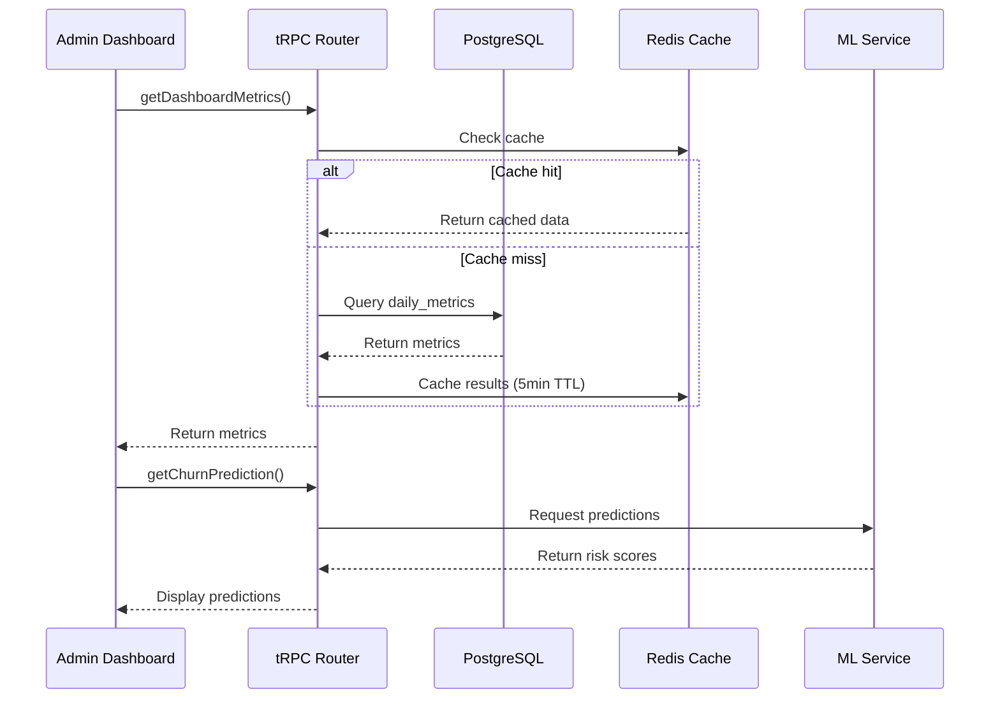

# 📊 Core Analytics Dashboard (20 Features)

# Core Analytics Dashboard

## Overview
Implement comprehensive analytics dashboard with real-time metrics, retention cohorts, funnel analysis, and predictive ML models for the dating platform.

## Features to Implement

### Real-time Metrics (Features 1-4)
1. **DAU/MAU/WAU Dashboard** - Live user activity tracking
2. **Retention Cohorts** - D1-D30 heatmap visualization
3. **Funnel Analysis** - Signup→Profile→Matches→Chats→Paid conversion
4. **Revenue Breakdown** - Subscriptions/Boosts/Ads streams

### Advanced Analytics (Features 5-10)
5. **Churn Prediction ML Model** - AI-powered forecasting
6. **A/B Testing Dashboard** - Experiment results tracking
7. **Geographic Heatmaps** - User distribution (Kaliningrad focus)
8. **Device/OS/Browser Analytics** - Platform usage stats
9. **Feature Usage Tracking** - Adoption metrics
10. **NPS/CSAT Scores** - Customer satisfaction

### Performance Metrics (Features 11-20)
11. Match success rate by demographics
12. Message response time analytics
13. Peak hours heatmap
14. Conversion funnels by acquisition channel
15. LTV/CAC ratio calculator
16. Cohort revenue analysis
17. User journey timelines
18. Predictive churn alerts
19. Marketing ROI dashboard
20. Custom KPI builder

## Technical Implementation



## Components to Build

### 1. Dashboard Overview Page
**File:** `file:apps/admin/app/(admin)/analytics/overview/page.tsx`

**Components:**
- `KPICard` - Display key metrics with trend indicators
- `RevenueChart` - Line/Area chart for revenue trends
- `UserGrowthChart` - Multi-line chart for DAU/MAU/WAU
- `QuickStats` - Grid of important metrics

### 2. Retention Analysis Page
**File:** `file:apps/admin/app/(admin)/analytics/retention/page.tsx`

**Components:**
- `RetentionHeatmap` - D1-D30 cohort visualization
- `CohortTable` - Detailed cohort data table
- `RetentionTrends` - Line chart showing retention over time

### 3. Funnel Analysis Page
**File:** `file:apps/admin/app/(admin)/analytics/funnels/page.tsx`

**Components:**
- `FunnelChart` - Visual funnel representation
- `ConversionRates` - Stage-by-stage conversion metrics
- `DropoffAnalysis` - Identify where users drop off

### 4. Revenue Dashboard
**File:** `file:apps/admin/app/(admin)/analytics/revenue/page.tsx`

**Components:**
- `RevenueBreakdown` - Pie/Donut chart by source
- `ARPUChart` - Average revenue per user trends
- `LTVCalculator` - Lifetime value analysis
- `RevenueForecasts` - Predictive revenue modeling

## tRPC Routers

### Analytics Router
**File:** `file:apps/admin/server/routers/analytics.ts`

**Endpoints:**
```typescript
analyticsRouter = {
  getDashboardMetrics: protectedProcedure
    .input(z.object({ startDate, endDate }))
    .query(),
  
  getRetentionCohorts: protectedProcedure
    .input(z.object({ startDate, endDate }))
    .query(),
  
  getFunnelAnalysis: protectedProcedure
    .input(z.object({ startDate, endDate }))
    .query(),
  
  getRevenueBreakdown: protectedProcedure
    .input(z.object({ period }))
    .query(),
  
  getChurnPrediction: protectedProcedure
    .query(),
  
  getGeoDistribution: protectedProcedure
    .query(),
  
  getCustomKPI: protectedProcedure
    .input(z.object({ kpiConfig }))
    .query(),
}
```

## Database Queries

**Key Tables:**
- `daily_metrics` - Aggregated daily statistics
- `retention_cohorts` - Cohort retention data
- `analytics_events` - Raw event tracking
- `revenue_transactions` - Transaction history

**Indexes Required:**
```sql
CREATE INDEX idx_daily_metrics_date ON daily_metrics(date DESC);
CREATE INDEX idx_analytics_events_user_id ON analytics_events(user_id);
CREATE INDEX idx_analytics_events_event_type ON analytics_events(event_type);
CREATE INDEX idx_retention_cohorts_date ON retention_cohorts(cohort_date DESC);
```

## Chart Libraries Integration

**Recharts 3:**
- Line charts for trends
- Area charts for cumulative metrics
- Bar charts for comparisons

**ApexCharts 4:**
- Heatmaps for retention
- Funnel charts for conversion
- Radial charts for percentages

**Tremor 3:**
- KPI cards with trends
- Sparklines for quick insights
- Data tables with sorting

## Real-time Updates

**Implementation:**
```typescript
// Subscribe to real-time metrics
const { data } = trpc.analytics.subscribeToMetrics.useSubscription();

// Update every 30 seconds
useEffect(() => {
  const interval = setInterval(() => {
    refetch();
  }, 30000);
  return () => clearInterval(interval);
}, []);
```

## Acceptance Criteria

- [ ] Dashboard loads in < 2 seconds
- [ ] All 20 analytics features are functional
- [ ] Real-time metrics update every 30 seconds
- [ ] Retention heatmap displays correctly
- [ ] Funnel analysis shows accurate conversion rates
- [ ] Revenue breakdown matches transaction data
- [ ] Churn prediction model returns risk scores
- [ ] Geographic heatmap renders user locations
- [ ] Custom KPI builder allows metric configuration
- [ ] All charts are responsive and interactive
- [ ] Data exports work (CSV, Excel, JSON)
- [ ] Date range filters apply correctly

## Dependencies
- `ticket:d20d9731-f08e-4c42-83f3-53fa763e440e/[infrastructure-ticket-id]` (Project Infrastructure)

## Estimated Effort
7-10 days

## Performance Targets
- Dashboard load time: < 2s
- Chart render time: < 500ms
- API response time: < 300ms
- Real-time update latency: < 1s

## Related Files
- `file:apps/admin/app/(admin)/analytics/`
- `file:apps/admin/components/analytics/`
- `file:apps/admin/server/routers/analytics.ts`
- `file:packages/database/src/schema/admin.ts`
