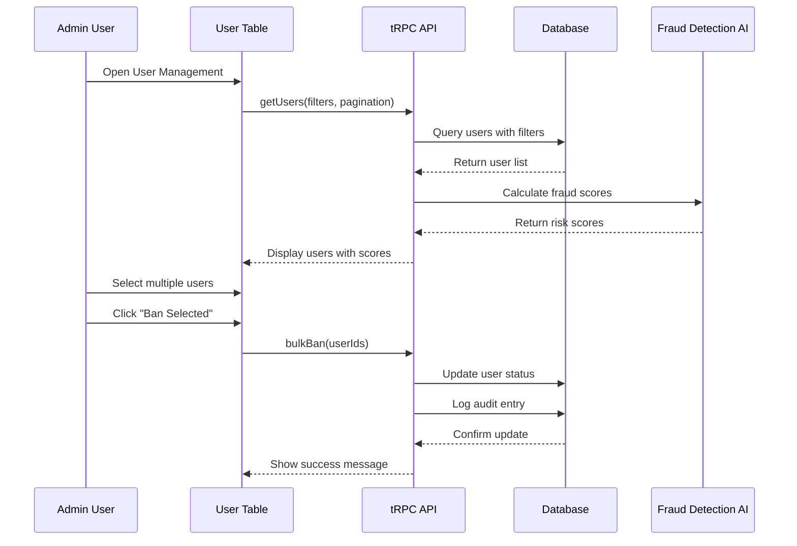

# 👥 User Management System (25 Features)

# User Management System

## Overview
Build comprehensive user management system with advanced search, bulk actions, fraud detection, verification workflows, and user segmentation capabilities.

## Features to Implement

### Core User Management (Features 21-30)
21. **Infinite Scroll Users Table** - High-performance table with 100+ filters
22. **Bulk Actions** - Ban/Suspend/Verify multiple users
23. **Advanced Search** - Psychographics/Behavior-based search
24. **User Profiles Deep Dive** - Comprehensive user view
25. **Activity Timelines** - User action history
26. **Fraud Detection Scoring** - AI-powered fraud analysis
27. **Fake Profile Detector** - Automated fake account detection
28. **Verification Queue** - ID/Photo/Manual verification workflow
29. **Blacklist Management** - User blocking system
30. **VIP/Premium User Dashboard** - Premium user management

### Advanced Features (Features 31-45)
31. User Segmentation (RFM Analysis)
32. Export Users (CSV/Excel/JSON)
33. User Notes/Tags System
34. Account Recovery Requests
35. Multi-Account Detection
36. Age/Gender/Location Verification
37. Phone/Email Validation Logs
38. Login Attempt Monitoring
39. Session Management
40. User Feedback/Suggestions
41. Complaint History
42. Behavioral Scoring
43. Engagement Scoring
44. Match Quality Scoring
45. Profile Completeness Audit

## Technical Implementation



## Components to Build

### 1. User Table Component
**File:** `file:apps/admin/components/users/UserTable.tsx`

**Features:**
- Virtual scrolling for 10,000+ users
- Multi-column sorting
- Advanced filtering (100+ filter options)
- Bulk selection with actions
- Inline editing
- Export functionality

**Filters:**
```typescript
interface UserFilters {
  status: 'all' | 'active' | 'suspended' | 'banned';
  verification: 'all' | 'verified' | 'unverified' | 'pending';
  subscription: 'all' | 'free' | 'gold' | 'platinum';
  fraudRisk: 'all' | 'low' | 'medium' | 'high' | 'critical';
  ageRange: [number, number];
  gender: string[];
  location: string;
  registrationDate: [Date, Date];
  lastActive: [Date, Date];
  matchCount: [number, number];
  messageCount: [number, number];
}
```

### 2. User Profile Deep Dive
**File:** `file:apps/admin/components/users/UserProfile.tsx`

**Sections:**
- Basic Information
- Photos & Media
- Verification Status
- Activity Timeline
- Match History
- Chat History
- Payment History
- Fraud Analysis
- Admin Notes
- Action Buttons

### 3. Fraud Detection Dashboard
**File:** `file:apps/admin/components/users/FraudScore.tsx`

**Metrics:**
- Overall fraud score (0-100)
- Risk level (Low/Medium/High/Critical)
- Risk factors breakdown
- AI confidence score
- Historical fraud patterns
- Recommended actions

### 4. Verification Queue
**File:** `file:apps/admin/app/(admin)/users/verification/page.tsx`

**Workflow:**
1. User submits verification (ID + selfie)
2. AI pre-screening (face matching, document validation)
3. Queue prioritization (high-risk users first)
4. Manual review by moderator
5. Approve/Reject with notes
6. User notification

### 5. User Segmentation
**File:** `file:apps/admin/components/users/UserSegmentation.tsx`

**RFM Analysis:**
- **Recency:** Last activity date
- **Frequency:** Login frequency, match rate
- **Monetary:** Subscription tier, purchases

**Segments:**
- Champions (High R, F, M)
- Loyal Users (High F, M)
- At Risk (Low R, High F, M)
- Hibernating (Low R, F, M)
- New Users (High R, Low F, M)

## tRPC Routers

### Users Router
**File:** `file:apps/admin/server/routers/users.ts`

**Endpoints:**
```typescript
usersRouter = {
  // List & Search
  getUsers: protectedProcedure
    .input(z.object({ filters, pagination }))
    .query(),
  
  searchUsers: protectedProcedure
    .input(z.object({ query, filters }))
    .query(),
  
  // User Details
  getUserById: protectedProcedure
    .input(z.object({ userId }))
    .query(),
  
  getUserTimeline: protectedProcedure
    .input(z.object({ userId }))
    .query(),
  
  // Bulk Actions
  bulkVerify: protectedProcedure
    .input(z.object({ userIds }))
    .mutation(),
  
  bulkSuspend: protectedProcedure
    .input(z.object({ userIds, reason }))
    .mutation(),
  
  bulkBan: protectedProcedure
    .input(z.object({ userIds, reason }))
    .mutation(),
  
  // Fraud Detection
  getFraudScore: protectedProcedure
    .input(z.object({ userId }))
    .query(),
  
  detectFakeProfile: protectedProcedure
    .input(z.object({ userId }))
    .mutation(),
  
  // Verification
  getVerificationQueue: protectedProcedure
    .input(z.object({ status, priority }))
    .query(),
  
  approveVerification: protectedProcedure
    .input(z.object({ userId, notes }))
    .mutation(),
  
  rejectVerification: protectedProcedure
    .input(z.object({ userId, reason }))
    .mutation(),
  
  // Segmentation
  getUserSegments: protectedProcedure
    .query(),
  
  createSegment: protectedProcedure
    .input(z.object({ name, criteria }))
    .mutation(),
  
  // Export
  exportUsers: protectedProcedure
    .input(z.object({ filters, format }))
    .mutation(),
  
  // Notes & Tags
  addUserNote: protectedProcedure
    .input(z.object({ userId, note }))
    .mutation(),
  
  addUserTag: protectedProcedure
    .input(z.object({ userId, tag }))
    .mutation(),
}
```

## Database Schema

**Key Tables:**
- `users` - Main user data (from existing backend)
- `fraud_scores` - Fraud detection results
- `user_notes` - Admin notes on users
- `user_segments` - Segmentation definitions
- `verification_queue` - Verification requests
- `audit_logs` - All admin actions

## Fraud Detection AI

**File:** `file:apps/admin/lib/ai/fraud-detection.ts`

**Factors Analyzed:**
- Profile completeness
- Photo authenticity (stock photo detection)
- Behavioral patterns
- Device fingerprinting
- Multi-account detection
- Spam indicators
- Suspicious activity patterns

**Implementation:**
```typescript
interface FraudAnalysis {
  score: number; // 0-100
  riskLevel: 'low' | 'medium' | 'high' | 'critical';
  factors: {
    stockPhotos: number;
    incompleteProfile: number;
    suspiciousActivity: number;
    multipleAccounts: number;
    spamIndicators: number;
  };
  confidence: number;
  recommendations: string[];
}
```

## Acceptance Criteria

- [ ] User table loads 10,000+ users with virtual scrolling
- [ ] All 100+ filters work correctly
- [ ] Bulk actions (verify, suspend, ban) work on selected users
- [ ] User profile deep dive shows all relevant information
- [ ] Activity timeline displays chronological events
- [ ] Fraud detection scores are calculated accurately
- [ ] Fake profile detector identifies suspicious accounts
- [ ] Verification queue prioritizes high-risk users
- [ ] User segmentation (RFM) creates accurate segments
- [ ] Export functionality generates CSV/Excel/JSON files
- [ ] User notes and tags are saved and displayed
- [ ] Multi-account detection identifies duplicate users
- [ ] Session management shows active sessions
- [ ] All actions are logged in audit trail

## Dependencies
- `ticket:d20d9731-f08e-4c42-83f3-53fa763e440e/[infrastructure-ticket-id]` (Project Infrastructure)

## Estimated Effort
10-14 days

## Performance Targets
- User table load time: < 1.5s for 10,000 users
- Search response time: < 500ms
- Bulk action processing: < 3s for 100 users
- Fraud score calculation: < 2s per user

## Related Files
- `file:apps/admin/app/(admin)/users/`
- `file:apps/admin/components/users/`
- `file:apps/admin/server/routers/users.ts`
- `file:apps/admin/lib/ai/fraud-detection.ts`
- `file:backend/models/user.py` (existing backend)
