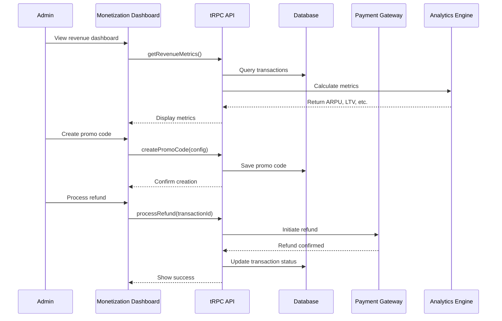

# 💰 Monetization & Revenue Management (15 Features)

# Monetization & Revenue Management

## Overview
Build comprehensive revenue management system with subscription management, pricing optimization, promo codes, payment processing, and financial analytics.

## Features to Implement

### Subscription Management (Features 66-70)
66. **Subscription Tiers Management** - Plan configuration
67. **Pricing A/B Tests** - Price optimization experiments
68. **Promo Code Campaigns** - Discount code management
69. **Revenue Forecasts** - Predictive revenue modeling
70. **Refund Processing** - Refund workflow management

### Payment Operations (Features 71-80)
71. Payment Gateway Monitoring
72. Failed Payments Retry
73. Coupon Redemption Tracking
74. Boost/Superlike Analytics
75. Gift/Premium Feature Usage
76. Affiliate Program Dashboard
77. Revenue by Acquisition Channel
78. ARPU/MARPU Trends
79. Churn by Subscription Tier
80. Upsell Opportunity Detection

## Technical Implementation



## Components to Build

### 1. Revenue Dashboard
**File:** `file:apps/admin/app/(admin)/monetization/overview/page.tsx`

**Metrics:**
- Total Revenue (Today/Week/Month/Year)
- ARPU (Average Revenue Per User)
- ARPPU (Average Revenue Per Paying User)
- MRR (Monthly Recurring Revenue)
- ARR (Annual Recurring Revenue)
- Churn Rate
- LTV (Lifetime Value)
- CAC (Customer Acquisition Cost)
- LTV/CAC Ratio

**Charts:**
- Revenue trend line chart
- Revenue breakdown by source (pie chart)
- Subscription tier distribution
- Payment method distribution
- Geographic revenue heatmap

### 2. Subscription Management
**File:** `file:apps/admin/app/(admin)/monetization/subscriptions/page.tsx`

**Features:**
- Create/Edit subscription plans
- Set pricing for different tiers
- Configure features per tier
- Set trial periods
- Manage billing cycles
- View active subscriptions
- Subscription analytics

**Subscription Tiers:**
```typescript
interface SubscriptionPlan {
  id: string;
  name: string;
  tier: 'free' | 'gold' | 'platinum';
  price: number;
  currency: string;
  duration: number; // days
  features: {
    unlimitedSwipes: boolean;
    seeWhoLikesYou: boolean;
    boostsPerMonth: number;
    superLikesPerDay: number;
    rewindUnlimited: boolean;
    incognitoMode: boolean;
    advancedFilters: boolean;
    priorityListing: boolean;
    messageBeforeMatch: boolean;
  };
  isActive: boolean;
}
```

### 3. Promo Code Manager
**File:** `file:apps/admin/components/monetization/PromoCodeManager.tsx`

**Features:**
- Create promo codes
- Set discount type (percentage/fixed)
- Set discount value
- Set usage limits
- Set validity period
- Track redemptions
- Analyze campaign performance

**Promo Code Types:**
- Percentage discount (e.g., 20% off)
- Fixed amount discount (e.g., $5 off)
- Free trial extension
- Feature unlock
- Referral rewards

### 4. Pricing A/B Testing
**File:** `file:apps/admin/app/(admin)/monetization/pricing-tests/page.tsx`

**Features:**
- Create pricing experiments
- Define test variants
- Set test duration
- Target specific segments
- Monitor conversion rates
- Analyze results
- Declare winner

**Test Configuration:**
```typescript
interface PricingTest {
  id: string;
  name: string;
  variants: {
    name: string;
    price: number;
    features: string[];
  }[];
  targetSegment: string;
  startDate: Date;
  endDate: Date;
  metrics: {
    conversions: number;
    revenue: number;
    conversionRate: number;
  }[];
}
```

### 5. Refund Processing
**File:** `file:apps/admin/components/monetization/RefundProcessor.tsx`

**Workflow:**
1. User requests refund
2. Admin reviews request
3. Check refund eligibility
4. Process refund via payment gateway
5. Update subscription status
6. Send confirmation to user
7. Log transaction

**Refund Policies:**
- Full refund within 7 days
- Partial refund within 30 days
- No refund after 30 days
- Abuse detection (multiple refunds)

### 6. Payment Gateway Monitor
**File:** `file:apps/admin/components/monetization/PaymentGatewayMonitor.tsx`

**Metrics:**
- Success rate
- Failure rate
- Average processing time
- Gateway uptime
- Error types
- Failed payment reasons

**Supported Gateways:**
- Stripe
- PayPal
- Apple Pay
- Google Pay
- Local payment methods

### 7. Revenue Forecasting
**File:** `file:apps/admin/components/monetization/RevenueForecasts.tsx`

**Models:**
- Linear regression
- Time series analysis
- Seasonal adjustments
- Growth rate projections

**Forecasts:**
- Next month revenue
- Next quarter revenue
- Year-end projection
- Confidence intervals

## tRPC Routers

### Monetization Router
**File:** `file:apps/admin/server/routers/monetization.ts`

**Endpoints:**
```typescript
monetizationRouter = {
  // Revenue Metrics
  getRevenueMetrics: protectedProcedure
    .input(z.object({ startDate, endDate }))
    .query(),
  
  getRevenueBreakdown: protectedProcedure
    .input(z.object({ period }))
    .query(),
  
  getARPU: protectedProcedure
    .input(z.object({ period }))
    .query(),
  
  getLTVAnalysis: protectedProcedure
    .query(),
  
  // Subscriptions
  getSubscriptionPlans: protectedProcedure
    .query(),
  
  createSubscriptionPlan: protectedProcedure
    .input(z.object({ plan }))
    .mutation(),
  
  updateSubscriptionPlan: protectedProcedure
    .input(z.object({ planId, updates }))
    .mutation(),
  
  getActiveSubscriptions: protectedProcedure
    .input(z.object({ filters }))
    .query(),
  
  // Promo Codes
  getPromoCodes: protectedProcedure
    .input(z.object({ status }))
    .query(),
  
  createPromoCode: protectedProcedure
    .input(z.object({ code, config }))
    .mutation(),
  
  getPromoCodeStats: protectedProcedure
    .input(z.object({ codeId }))
    .query(),
  
  // Pricing Tests
  getPricingTests: protectedProcedure
    .query(),
  
  createPricingTest: protectedProcedure
    .input(z.object({ test }))
    .mutation(),
  
  getPricingTestResults: protectedProcedure
    .input(z.object({ testId }))
    .query(),
  
  // Refunds
  getRefundRequests: protectedProcedure
    .input(z.object({ status }))
    .query(),
  
  processRefund: protectedProcedure
    .input(z.object({ transactionId, reason }))
    .mutation(),
  
  // Payment Gateway
  getPaymentGatewayStats: protectedProcedure
    .input(z.object({ gateway, period }))
    .query(),
  
  retryFailedPayment: protectedProcedure
    .input(z.object({ transactionId }))
    .mutation(),
  
  // Analytics
  getRevenueByChannel: protectedProcedure
    .input(z.object({ period }))
    .query(),
  
  getChurnByTier: protectedProcedure
    .input(z.object({ period }))
    .query(),
  
  getUpsellOpportunities: protectedProcedure
    .query(),
  
  // Forecasting
  getRevenueForecast: protectedProcedure
    .input(z.object({ months }))
    .query(),
}
```

## Database Schema

**Key Tables:**
- `subscription_plans` - Plan definitions
- `user_subscriptions` - Active subscriptions
- `revenue_transactions` - All transactions
- `promo_codes` - Promo code definitions
- `promo_redemptions` - Redemption tracking
- `refunds` - Refund records
- `pricing_tests` - A/B test configurations
- `payment_gateway_logs` - Gateway events

## Financial Calculations

**ARPU (Average Revenue Per User):**
```typescript
ARPU = Total Revenue / Total Active Users
```

**ARPPU (Average Revenue Per Paying User):**
```typescript
ARPPU = Total Revenue / Total Paying Users
```

**LTV (Lifetime Value):**
```typescript
LTV = ARPU × Average Customer Lifetime (months)
```

**Churn Rate:**
```typescript
Churn Rate = (Users Lost / Total Users at Start) × 100
```

**MRR (Monthly Recurring Revenue):**
```typescript
MRR = Sum of all monthly subscription values
```

## Acceptance Criteria

- [ ] Revenue dashboard displays accurate metrics
- [ ] Subscription plans can be created and edited
- [ ] Pricing A/B tests can be configured and monitored
- [ ] Promo codes can be created and tracked
- [ ] Revenue forecasts are generated
- [ ] Refund processing workflow is complete
- [ ] Payment gateway monitoring shows real-time stats
- [ ] Failed payment retry mechanism works
- [ ] Coupon redemption tracking is accurate
- [ ] Boost/Superlike analytics are displayed
- [ ] Affiliate program dashboard is functional
- [ ] Revenue by channel attribution works
- [ ] ARPU/MARPU trends are calculated correctly
- [ ] Churn by tier analysis is accurate
- [ ] Upsell opportunities are identified

## Dependencies
- `ticket:d20d9731-f08e-4c42-83f3-53fa763e440e/[infrastructure-ticket-id]` (Project Infrastructure)

## Estimated Effort
7-10 days

## Performance Targets
- Dashboard load time: < 2s
- Transaction query time: < 500ms
- Refund processing time: < 5s
- Forecast calculation: < 3s

## Related Files
- `file:apps/admin/app/(admin)/monetization/`
- `file:apps/admin/components/monetization/`
- `file:apps/admin/server/routers/monetization.ts`
- `file:packages/database/src/schema/monetization.ts`
