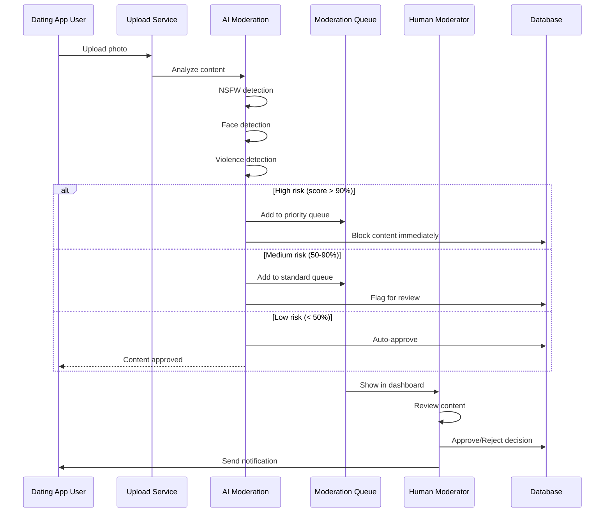

# 🛡️ Content Moderation System (20 Features)

# Content Moderation System

## Overview
Implement AI-powered content moderation system with photo review, NSFW detection, chat moderation, report handling, and automated policy enforcement.

## Features to Implement

### Core Moderation (Features 46-55)
46. **Photo Moderation Queue** - AI pre-filtered photo review
47. **NSFW Detection (99% Accuracy)** - Advanced content filtering
48. **Text Moderation** - Toxic chat detection
49. **Report Handling Workflow** - User report processing
50. **Auto-Ban Thresholds** - Automated violation handling
51. **Manual Review Dashboard** - Human moderation interface
52. **Moderation Stats** - Moderator performance metrics
53. **Appeal Handling** - User appeal processing
54. **Policy Violation Trends** - Violation pattern analysis
55. **Watermarking System** - Content protection

### Advanced Features (Features 56-65)
56. Content Aging (automatic deletion)
57. Duplicate Detection
58. Profile Template Violations
59. Chat History Review
60. Voice Note Transcription/Moderation
61. Video Verification
62. Live Stream Moderation (future)
63. Community Guidelines Dashboard
64. Moderation SLA Tracking
65. AI Moderator Performance Metrics

## Technical Implementation



## Components to Build

### 1. Moderation Queue Dashboard
**File:** `file:apps/admin/app/(admin)/moderation/queue/page.tsx`

**Features:**
- Grid view of pending content
- AI risk score badges
- Priority sorting
- Quick approve/reject actions
- Batch processing
- Filter by content type
- Filter by AI score range

**Layout:**
- 3-column grid for photos
- List view for chat messages
- Detailed view modal

### 2. Photo Review Component
**File:** `file:apps/admin/components/moderation/PhotoReview.tsx`

**Display:**
- Full-size photo preview
- User information
- AI analysis results
- NSFW score breakdown
- Previous violations
- Quick action buttons

**AI Analysis Display:**
```typescript
interface AIAnalysis {
  nsfwScore: number;
  categories: {
    nudity: number;
    violence: number;
    drugs: number;
    weapons: number;
    gore: number;
  };
  faceDetected: boolean;
  stockPhoto: boolean;
  duplicateOf?: string;
}
```

### 3. Chat Moderation
**File:** `file:apps/admin/components/moderation/ChatReview.tsx`

**Features:**
- Message thread view
- Toxic language detection
- Harassment patterns
- Spam detection
- User history
- Context preservation

**Toxicity Categories:**
- Harassment
- Hate speech
- Sexual content
- Violence threats
- Spam/Scam
- Personal information sharing

### 4. Report Handling
**File:** `file:apps/admin/app/(admin)/moderation/reports/page.tsx`

**Workflow:**
1. User submits report
2. AI pre-screening
3. Priority assignment
4. Moderator review
5. Action taken (warn/suspend/ban)
6. Reporter notification
7. Appeal option

**Report Types:**
- Inappropriate photos
- Harassment
- Fake profile
- Spam
- Underage user
- Other

### 5. Moderation Stats Dashboard
**File:** `file:apps/admin/components/moderation/ModerationStats.tsx`

**Metrics:**
- Total items reviewed (today/week/month)
- Average review time
- Approval rate
- Rejection rate
- Appeal rate
- Moderator performance
- AI accuracy
- SLA compliance

## AI Integration

### NSFW Detection
**File:** `file:apps/admin/lib/ai/nsfw-detection.ts`

**Provider:** HuggingFace (Falconsai/nsfw_image_detection)

**Implementation:**
```typescript
async detectNSFW(imageUrl: string): Promise<NSFWResult> {
  const response = await hf.imageClassification({
    data: await fetch(imageUrl).then(r => r.blob()),
    model: 'Falconsai/nsfw_image_detection',
  });
  
  return {
    isNSFW: response.find(r => r.label === 'nsfw')?.score > 0.7,
    score: response.find(r => r.label === 'nsfw')?.score || 0,
    categories: parseCategories(response),
  };
}
```

### Text Moderation
**File:** `file:apps/admin/lib/ai/text-moderation.ts`

**Provider:** OpenAI Moderation API

**Implementation:**
```typescript
async moderateText(text: string): Promise<ModerationResult> {
  const moderation = await openai.moderations.create({
    input: text,
  });
  
  const result = moderation.results[0];
  
  return {
    isToxic: result.flagged,
    categories: result.categories,
    scores: result.category_scores,
  };
}
```

## tRPC Routers

### Moderation Router
**File:** `file:apps/admin/server/routers/moderation.ts`

**Endpoints:**
```typescript
moderationRouter = {
  // Queue Management
  getModerationQueue: protectedProcedure
    .input(z.object({ 
      contentType, 
      status, 
      priority,
      aiScoreRange 
    }))
    .query(),
  
  getQueueStats: protectedProcedure
    .query(),
  
  // Content Review
  reviewContent: protectedProcedure
    .input(z.object({ 
      contentId, 
      decision, 
      notes 
    }))
    .mutation(),
  
  bulkReview: protectedProcedure
    .input(z.object({ 
      contentIds, 
      decision 
    }))
    .mutation(),
  
  // NSFW Detection
  analyzePhoto: protectedProcedure
    .input(z.object({ photoUrl }))
    .mutation(),
  
  // Text Moderation
  analyzeMessage: protectedProcedure
    .input(z.object({ messageId }))
    .mutation(),
  
  // Reports
  getReports: protectedProcedure
    .input(z.object({ status, type }))
    .query(),
  
  handleReport: protectedProcedure
    .input(z.object({ 
      reportId, 
      action, 
      resolution 
    }))
    .mutation(),
  
  // Appeals
  getAppeals: protectedProcedure
    .input(z.object({ status }))
    .query(),
  
  handleAppeal: protectedProcedure
    .input(z.object({ 
      appealId, 
      decision, 
      notes 
    }))
    .mutation(),
  
  // Stats
  getModerationStats: protectedProcedure
    .input(z.object({ startDate, endDate }))
    .query(),
  
  getModeratorPerformance: protectedProcedure
    .input(z.object({ moderatorId }))
    .query(),
  
  // Auto-moderation
  updateAutoModThresholds: protectedProcedure
    .input(z.object({ thresholds }))
    .mutation(),
}
```

## Database Schema

**Key Tables:**
- `moderation_queue` - Pending content for review
- `nsfw_detections` - NSFW analysis results
- `reported_content` - User reports
- `moderation_actions` - Actions taken by moderators
- `appeals` - User appeals
- `auto_mod_rules` - Automated moderation rules

## Auto-Moderation Rules

**Configuration:**
```typescript
interface AutoModRules {
  nsfwThreshold: number; // Auto-reject if score > threshold
  toxicityThreshold: number;
  spamThreshold: number;
  violationCountBan: number; // Auto-ban after X violations
  appealWindow: number; // Days to appeal
  contentAging: number; // Days before auto-delete
}
```

**Default Rules:**
- NSFW score > 95% → Auto-reject + flag user
- NSFW score > 70% → Manual review required
- 3 violations in 30 days → Temporary suspension
- 5 violations in 90 days → Permanent ban
- Toxic message → Immediate block + warning
- Spam detected → Shadow ban

## Acceptance Criteria

- [ ] Moderation queue displays all pending content
- [ ] AI pre-screening filters 80%+ of content automatically
- [ ] NSFW detection achieves 99%+ accuracy
- [ ] Text moderation detects toxic content accurately
- [ ] Report handling workflow is complete
- [ ] Auto-ban thresholds work correctly
- [ ] Manual review interface is intuitive
- [ ] Moderation stats are accurate
- [ ] Appeal handling process works
- [ ] Policy violation trends are tracked
- [ ] Watermarking system protects content
- [ ] Duplicate detection identifies copies
- [ ] Voice note transcription works
- [ ] SLA tracking shows compliance metrics
- [ ] AI performance metrics are displayed

## Dependencies
- `ticket:d20d9731-f08e-4c42-83f3-53fa763e440e/[infrastructure-ticket-id]` (Project Infrastructure)

## Estimated Effort
8-12 days

## Performance Targets
- Queue load time: < 1s
- AI analysis time: < 2s per item
- Review action processing: < 500ms
- Bulk review: < 5s for 50 items

## Related Files
- `file:apps/admin/app/(admin)/moderation/`
- `file:apps/admin/components/moderation/`
- `file:apps/admin/server/routers/moderation.ts`
- `file:apps/admin/lib/ai/nsfw-detection.ts`
- `file:apps/admin/lib/ai/text-moderation.ts`
